# **Modelagem de Ddos**

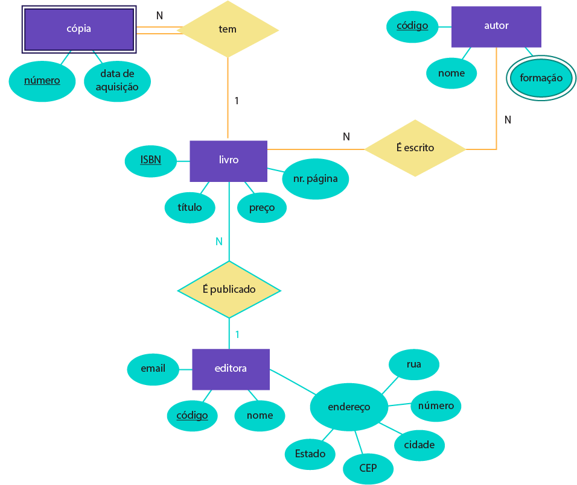

# **Dados x Informações**

Dados: São fatos em uma forma primária, que podem ser armazenados em algum meio.

 - EX.: CPF, Nome, Data

Informação: São os fatos organizaddos de maneira a produzir um significado -> Dados colocados em contexto.

 - Ex.: Lista de clientes com seus números de CPF, ordenados, onde os CPF estão em ordem que foram cadastrados.

# **Metadados**

 - Definimos Metadados com sendo "Dados sobre os dados".

 - Permitem efetuar a representação e identificação dos dados, garantindo sua consistência e persistência.

 - Os Metadados são mantidos no Dicionário de Dados (ou em um Catálogo de Dados).

# **Banco de Dados**

Um banco de dados (DB) é uma coleção organizada de dados. Esses dados são organizados de modo a modelar aspectos do mundo real, para que seja possível efetuar processamento que gere informações relevantes para os usuários a partir desses dados.

Um DB é composto por diversos objetos, tais como: tabelas, esquemas, visões, consultas, relatórios, procedimentos, triggeres, entre outros. O mais importantes são as tabelas e os relacionamentos.

**Triggers**: Os triggers em banco de dados são conjuntos de ações que são automaticamente executadas em resposta a eventos específicos, como INSERT, UPDATE ou DELETE. Eles podem ser usados para:

 - Manter a integridade dos dados
 - Realizar auditoria
 - Automatizar ações

Tipos
 - Before triggers (antes da operação)
 - After triggers (após a operação)

Importante
 - Podem aumentar a complexidade do banco de dados
 - Podem afetar o desempenho do banco de dados

# **Aplicações dos Bancos de Dados**

Bancos de dados encontram aplicações em inúmeras áreas, como:

 - Sistemas bancários
 - Reservas de hoteis
 - Controle de estoque em supermercados
 - Catálogo de livros em bibliotecas
 - E-commerce
 - Receita Federal
 - You Tube
 - Sites de comércio eletrônico
 - Plataformas de redes sociais
 - Blogs e portais de notícias
 - Business Intelligence (BI)
 - Data Mining
 - Análise de dados científicos
 - Aplicações de jogos online
 - Plataformas de aprendizado online
 - Sistemas de gerenciamento de conteúdo

# **SGBD**

 - Um SGBD é uma coleção de softwares que permite aos usuários criarem e manterem um ou mais bancos de dados.
 - São usados nas tarefas de definição, construção, manipulação e compartilhamento dos bancos de dados entre aplicações e  usuários.
 - Permitem proteger o banco de dados e mantê-lo ao longo do tempo.

# **Exemplos de SGBDs**

 - Oracle DataBse
 - Microsoft SQL Server - SGBDR -> SQL Server
 - MySQL
 - IBM DB2
 - SAP Sybase
 - MongoDB
 - Teradata
 - PostgreSQL
 - SQLite

# **Sistema de Bancos de Dados**

A figura a seguir ilustra a relação entre usuários, bancos de dados, SGBDs e as aplicações que acessam os dados.

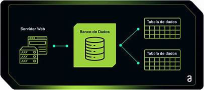

# **Usuários de Bancos de Dados**

 - Administrador
 - Projetista / Desenvolvedor
 - Usuário Final
  
# **Características e Funcionalidades**

 - Controle de Redundância
 - Múltiplas Visões dos Dados
 - Controle de Concorrência - gerencia para evitar que um desenv. subscreva o que outro está tentando gravar.
 - Backup e Restauração
 - Restrições de Integridade - não poder cadastrar um produto sem que tenha o fornecedor, cadastrar o usuário sem que ele forneça o CPF para que seja escrito na tabela.

# **Modelo Hierárquico**

 - Neste modelo os dados são organizaddos de forma hierárquica, com conjuntos de tipos de registros interconectados por meio de ligações.
 - Uma ligação representa uma relação entre dois tipos de registros: pai e filho.
 - Um esquema no modelo hierárquico é um diagrama de estrutura em árvore.
 - O acesso aos dados é sempre unidirecional, a partir do pai para o filho.

 

# **Modelo em Rede**

 - No modelo em Redes os dados são organizados em tipos e ligações entre dois registros.
 - Não há restrição hierárquica.
 - Tanto o esquema quanto ocorrências de dados são visualizados como um grafo direcionado.
 - (Grafo -> Tipo de estrutura de dados).

# **Modelo em Rede**

# **Modelo Relacional**

 - Neste modelo os dados são separados em entidades, conforme cada assunto, e registrados como atributos dessas entidades.
 - As entidades se relacionam entre si e permitem que os dados sejam armazenados e recuperados de forma rápida e segura.

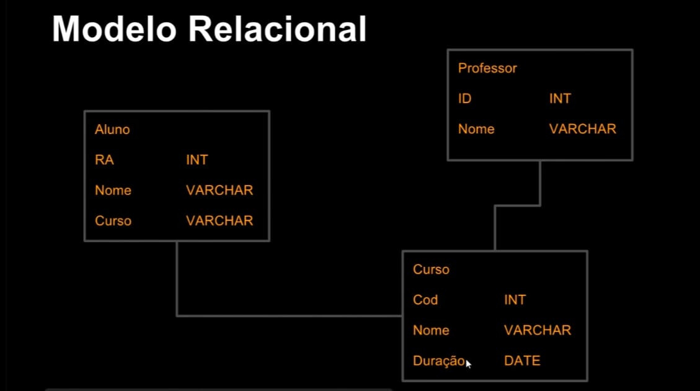

# **Introdução ao Modelo Relacional** 

# **Modelagem de Dados**

 - Modelagem de Dados é o processo de criação de um Modelo de Dados para um sistema de informação, com a aplicação de técnicas específicas de modelagem.
 - Trata-se de processos para definir e analisar requisitos de dados necessários para suportar processos de negócio com sistemas informatizados em organização.
 - Um modelo de dados fornece uma estrutura para os dados usados em um SI, com definições e formatos específicos.

# **Modelos de Dados**

 - Hierárquico
 - Rede
 - *Relacional*
 - Orientado a Objetos
 - Não-Relacional
  
# **Modelo Relacional**

 - Os princípios do modelo relacional foram esboçados por E.F. Codd (IBM) em um artigo publicado em junho de 1970, intitulado " A Relational Model of Data for Large Shared Data Banks", no qual o Dr. Codd propôs o modelo relacional para sistemas de bancos de dados.
 - Antes disso eram usados modelos como o hierárquico e o modelo em rede.

# **Modelo Relacional**

 - No modelo relacional os dados são organizados em coleções de tabelas bidimensionais.
 - Essas tabelas são também chamadas de "Relações".
 - Relação é uma forma de se organizar os dados em linhas e colunas.
 - Baseado em lógica e teoria de conjuntos.

# **Componentes do Modelo Relacional**

### O modelo relacional é composto, basicamente por:

 - Coleções de objetos ou relações que armazenam os dados.
 - Um conjunto de operadores que agem nas relações, produzindo outras relações.
 - Integridade de dados, para precisão e consistência.

# **Banco de Dados Relacional**

 - Um Banco de dados relacional é uma coleção de relações, que são tabelas bidimensionais, onde os dados são armazenados.
 - Como exemplo, podemos querer armazenar dados sobre os clientes de uma loja. Pora isso criamos tabelas para guardar diferentes conjuntos de dados relacionados a esses cslientes, como dados pessoais, dados de compras, crédito, e outras.
  
# **Componentes de um Banco de Ddos Relacional**

 - **Tabela**: estrutura básica de armazenamento no SGBDR. Armazena todos os dados necessários sobre algo do mundo real, como clientes, pedidos ou produtos, também chamada de Relação. Um banco de dados relacional pode conter uma ou mais tabelas.
 - **Tupla**: ou linha / registro, representa todos os dados requeridos por uma determinada ocorrência de entidade em particular. Por exemplo, os dados de um cliente específico. Cada linha em uma tabela dever ser identificada por uma chave primária, de modo a não haver duplicação de registros.
 - **Coluna**: unidade que armazena um tipo específico de dado (valor) - ou não armazena  nada, com valor nulo. Esta é uma *coluna não chave*, significando que seu valor pode se repetir em outras linhas da tabela.
 - **Relacionamento**: associação entre as entidades (tabelas), conectadas por chaves primárias e chaves estrangeiras.
 - **Outros**: índices, SP, Triggers, etc.
 - **Chave Primária**: coluna (atributo) que identifica um registro de forma exclusiva na tabela. Por exemplo, o CPF de um cliente, contendo um valor que não se repete.
 - **Chave estrangeira**: coluna que define como as tabelas se relacionam umas com as outras. Uma FK se refere a uma PK ou a uma chave única em outra tabela ( ou na mesma tabela). Por exemplo, na tabela de pedidos podemos ter uma chave estrangeira efetuando o relacionamento com a chave primária na tabela de clientes.

# **Análise de Requisitos**

 - Nesta fase, são realizadas reuniões para coleta de informações, que analisam o que é exigido para o banco de dados a ser criado.
 - Os processos de negócio são definidos, e as entidades, atributos e relacionamentos do BD são documentados.
 - A análise é extremamente importante para o sucesso do projeto do BD.

# **Modelo Entidade-Relacionamento**

 - MER, cria um diagrama entidade-relacionamento a partir das especificações do negócio ou narrativas do usuário. Permite ilustrar as entidades em um negócio e também relacionamentos entre elas. Construímos o MER durante a fase de análise no ciclo de vida de desenvolvimento do sistema.
 - Um MER separa a informação necessária a um negócio das atividades que são realizadas no negócio.

# **Componentes do MER**

 - **Entidade**: algo significativo, sobre o qual devemos possuir informações. Como exemplos, temos clientes, funcionários, pedidos e produtos.
 - **Atributos**: algo que descreve ou qualifica uma entidade. Por exemplo, a entidade cliente possui atributos que descrevem seu nome, endereço, telefone, número de identificação, entre outros. Atributos podem ser obrigatórios ou opcionais.
 - **Relacionamento**: trata-se de uma associação nemeada entre entidades, com um grau de associação. Por exemplo, clientes podem estar associados a pedidos.

# **Convenções para modelagem de entidades, relacionamentos e atributos**

 - **Entidades**: nome único, singular; em caixa alta;
 - **Atributos**: nome no singular; caixa baixa; atributos obrigatórios marcados com'*'; identificador único marcado com'#'.
 - **Relacionamentos**: nome identificador (verbo); opcionalidade("deve ser" ou "pode ser"); grau ou cardinalidade ('um e apenas um', ou 'um ou mais')
 - **Cardinalidade**: significa que cada entidade pode ser ou deve em relação de forma uma e apenas uma ou uma ou mais com outra entidade.

  **Identificador único (UID)**

  - Um identificador único é qulquer combinação de atributos ou relacionamentos que são usados para distinguir ocorrências de uma entidade. Cada ocorrência da entidade deve ser identificável de forma exclusiva.

# **Modelagem de Dados - Níveis**

## **Classificamos o processo de modelagem de dados em três níveis**:

 - Modelo Conceitual ( alto nível) - MCD -> Modelo Conceitual de Dados.
 - Modelo Lógico - MLD.
 - Modelo Físico (baixo nível) - MFD.

# **Modelo Conceitual**

Esta é a primeira fase da modelagem, onde representamos o mundo real por meio de uma visão simplificada dos dados e seus relacionamentos. Assim poderemos determinar quais informações serão armazenadas no DB.
Neste nível o projeto é independente de SGBD.

Exemplo: 
**Cadastro de Produtos em uma Loja**
Dados necessários: Nome do produto, categoria de produto (limpeza, higiene, etc), código do fornecedor, tipo de embalagem, tamanho, quantidade.
Neste nível, detalhes da implementação não aparecem, porém é suficientemente detalhado para a ponto de ser possível descrever os tipos de dados requeridos, seus relacionamentos entre si e regras de consistência.

# **Modelo Lógico**

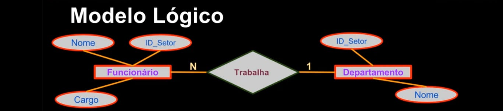

 - Um modelo lógico possui conceitos que os usuários são capazes de entender, ao mesmo tempo em que não está distante do modelo físico do banco de dados.
 - Neste nível o projeto é independente do SGBD.
 - Consiste na especificação lógica dos dados em um formato adequado ao SGBD escolhido. Os tipos de dados são completamente definidos.
  
# **Modelo Físico**

 - A partir de um modelo lógico nós derivamos o modelo físico, onde se detalham os componentes de estrutura física do banco de dados, incluindo as tabelas, campos, tipos de valores, restrições, etc.
 - Ao criarmos o modelo físico, poderemos partir para a implementação física do banco de dados, utilizando o SGBD mais adequado.

# **Arquitetura de Três Níveis**

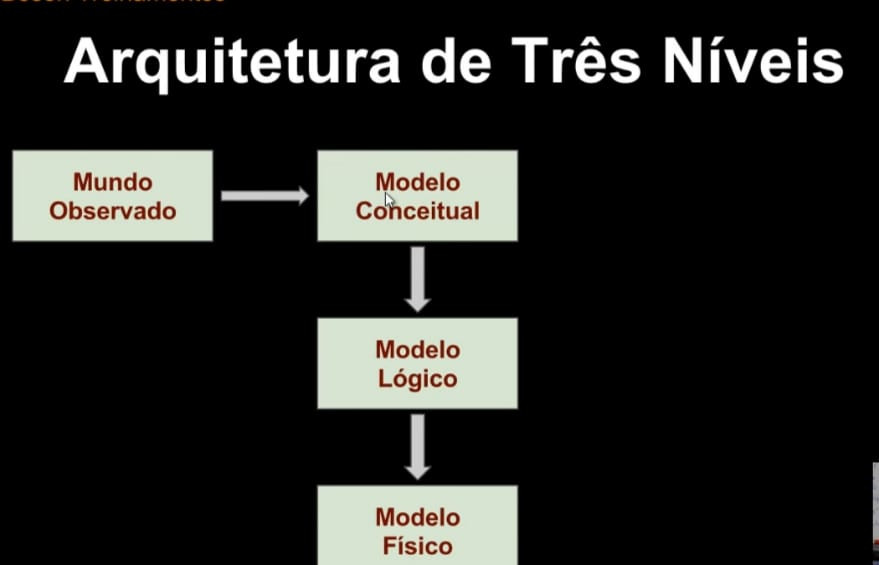

# **Esquema do Banco de Dados**

 - Um esquema é uma definição do Banco de Dados especificada durante o projeto, armazenada no *Dicionário de Dados*.
 - Um esquema (Schema) raramente muda durante a vida do BD.
 - Trata-se da organização dos dados em um plano que mostra como o banco é construído.
 - O esquema define tabelas, campos, relacionamentos, visões, funções e muitos outros elementos que compõem o BD.
  
# **Etapas do desenvolvimento de um BD.**

As principais etapas no desenvolvimento de um DB são:

   1. Especificação e Análise de Requisitos:
      - Os requisitos são documentos.
   2. Projeto Conceitual:
      - Baseados nos requisitos.
   3. Projeto Lógico:
      - Expresso em um modelo de dados, como o relacional.
   4. Projeto Físico:
      - Especificações para armazenar e acessar o banco de dados.
      - Implementação do DB, inserção do DB, inserção de dados reais e manutenção.

# **Tarefas para Modelagem**

As tarefas a seguir devem ser realizadas para que seja possível efetuar modelagem de dados e projeto de BD funcional:

 - Identificar os tipos de entidade.
 - Identificar atributos.
 - Identificar relacionamentos.
 - Criar e associar chaves.
 - Normalizar para reduzir redundância.
 - Desnormalizar para aumentar performance.

# **MER**

Após o levantamento dos requisitos, estes são transformaddos em um **Modelo**
**Entidade-Relacionamento (MER)**, o qual consiste dos seguintes elementos:

 - Entidades.
 - Relacionamentos.
 - Atributos.

O modelo é posteriormente refinado com o uso de técnicas específicas, e finalmente implementado em um banco de dados físico.

# **Modelo Entidade-Relacionamento**

Também conhecido pela sigla MER, trata-se de um modelo conceitual usado para descrever objetos envolvidos no domínio de um sistema a ser construído, incluindo seus atributos e relacionamentos.
O MER permite representar de forma abstrata a estrutura que irá constituir o banco de dados.
É composto pelos seguintes objetos:

 - Entidades.
 - Atributos.
 - Relacionamentos.
  
# **MER**

Um modelo entidade relacionamento é uma maneira sistemática de descrever e definir um processo de negócio.
O processo é modelado como componentes (entidades) que são ligadas umas às outras por relacionamentos que indicam as dependências entre elas.
As entidades podem ter várias propriedades (atributos) que as caracterizam.
Diagramas são criados para representar graficamente entidades, atributos e relacionamentos, denominados **Diagramas Entidade- Relacionamento (DER).**

# **Modelo e Diagramas**

 - Modelo ER (MER): lista de entidades, atributos e relacionamentos, que traz informações sobre tipos de dados, restrições, descrições de entidades e outras.
 - Diagrama ER (DER): representação gráfica associada ao MER ( ou parte dele).

# **Componentes do DER**

 - Retângulos - Representam entidades.
 - Elipse - Representam atributos.
 - Losangos - representam relacionamentos.
 - Linhas - ligam atributos a entidades e entidades a relacionamentos.

# **Exemplo de DER**

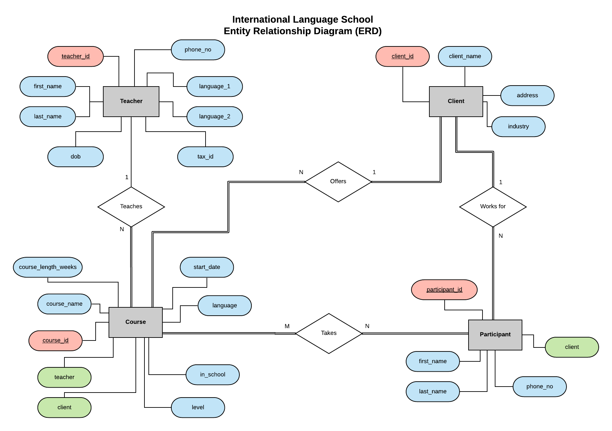

# **Entidade**

 - Algo de importância para um usuário ou organização que precisa ser representado em um banco de dados.
 - Representar um tema, tópico ou conceito de negócio.
 - Cada objeto de uma entidade é denominado de **Intância de Entidade.**
 - Uma entidade pode ter existência física ou abstrata.

Ex.: Empregados, Livros, Vendas, Produtos.

 - Nomeamos as entidades usando substantivo que representam de forma clara e objetiva sua função.
 - Por exemplo, podemos ter em um sistema as entidades Produto, Cliente, Venda, Estoque, Catálogo, entre outras.
 - Representamos as entidades em um DER por meio de retângulos contendo o nome da entidade.

# **Algumas regras de nomeação das Entidades**

 - Nomes de Entidade:
    - Devem começar com uma letra;
    - Usar palavra no singular;
    - Não podem ter espaços ou alguns caracteres especiais;
    - Alguns caracteres com "$", "#" e "_" são permitidos em alguns bancos de dados.

 - Os nomes das colunas devem ser únicos dentro de uma tabela.
 - Os nomes de entidades / tabelas devem ser únicos dentro do esquema.

# **Instância de Entidades**

Uma instância em si é uma descrição da estrutura e formato das ocorrências da entidade, como uma "receita" ou "planta".
Uma instância de entidade é uma ocorrência específica de uma entidade.

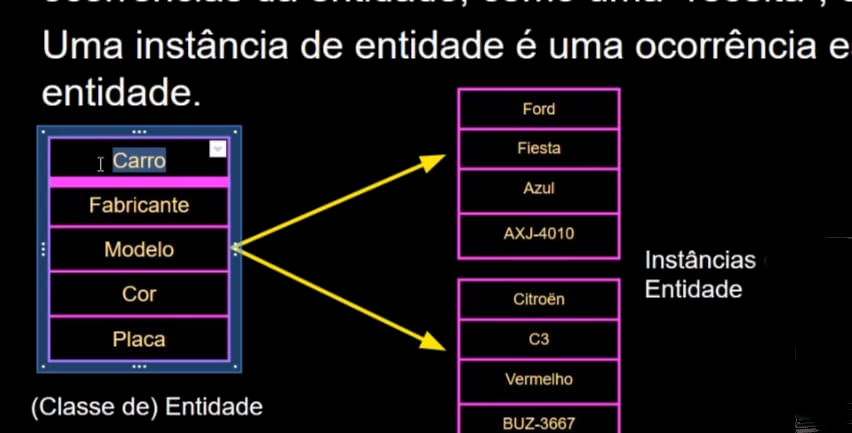

# **Atributos**

 - Os atributos descrevem características da entidade, como por exemplo: fabricante, modelo, cor, placa, etc.
 - Os atributos possuem um tipo de dados (domínio) nome e valor específico.
  
# **Representando Atributos**

 - Os atributos podem ser representados por uma elipse contendo o seu nome, ligado à entidade que qualifica
 - Opcionalmente, podemos representar um atributo apenas pelo seu nome ligado à entidade, sem utilizar a elipse.

# **Tipos de Atributos**

 - Simples.
 - Composto.
 - Multivalorado.
 - Determinante.
 - Identificador entre outros.

# **Atributos Simples / Atômico**

Não posui características especiais, e não indivisíveis.

Ex.: Nome da empresa, CPF, CNPJ.

# **Atributos Composto**

É formado por itens menores; pode ser subdividido em outros atributos.

Ex.: Endereço da Empresa:  **Empresa** -> Endereço: Rua + CEP + Bairro ( subatributos).

# **Atributo Multivalorado**

Pode conter mais de um valor para um mesmo registro (informação).

Ex.: Telefone da empresea: **Empresa** -> *Telefone ( '*' para dizer que é multivalorado)

# **Atributo Determinate**

Define de forma única as instâncias de uma entidade.
Não podem existir duas instãncias com o mesmo valor nesse atributo.

Ex.: CNPJ da empresa, Código de Produto.

**Empresa** -> <u>CNPJ</u> ( Colocar um sumblinhado no atributo determinante)

# **Atributo Identificadores ("Chaves")**

Uma *chave* identifica uma instância específica na classe de entiodade.

Ex.: CPF, CódigoProduto, Matrícula, ID_Setor.

As chaves podem ser únicas ou não-únicas:

 - Únicas: o valor dos dados da chave é único na entidade.
 - Não-única: usada para agrupar instâncias de classe em categorias.

As chaves podem ser compostas, consistindo de dois ou mais atributos combinados.
  

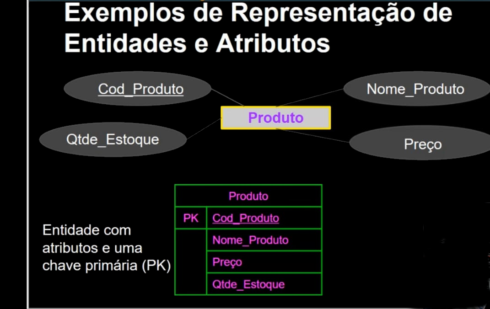

# **Exemplos de Representação de Entidades e Atributos**

Podemos também representar uma entidade de forma textual:

Produto(<u>Cod_Produto</u>,Nome_Produto, Preço, Qtde_Estoque), **Cod_Produto** grifado por ser determinate.

# **Entidas x Relação**

 - Uma entidade é um conceito do mundo real, como por exemplo um Cliente ou um Produto.
 - Uma Relação é um conjunto de registros (tuplas) que representam um modelo de uma entidade.
 - Cada registro representa uma instância de entidade, e o conjunto de todas as instâncias, com seus atributos, é chamado de Relação.
  
# **Relação**

Tabela bidimensional com características específicas, compostas por linhas e colunas, criada a partir de uma entidade.

Características de uma relação:

 - Linhas contém dados sobre instâncias de uma entidade (registros).
 - Colunas contém dados sobre atributos da entidade (campos).
 - Cada célula da tabela armazena um único valor.
 - Todos os valores em uma coluna são do mesmo tipo (domínio).
 - Cada coluna posui um nome único.
 - Não há duas linhas idênticas.
 - As relações geralmente geram tabelas no banco.

# **Exemplo de uma Relação**

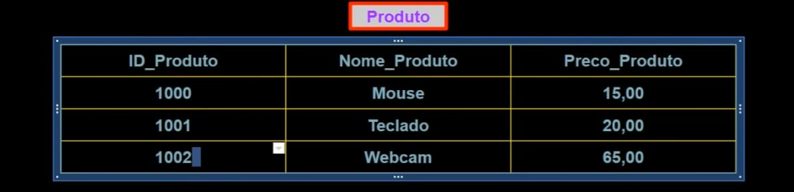

"Toda Relação é uma tabela, mas nem toda tabela é uma relação"

# **Relação - Exemplo completo**

# **Relacionamentos**

 - As Entidades podem ser conectadas entre si por meio de Relacionamentos.
 - Trata-se de uma estrutura que indica a associação de elementos de uma ou mais entidades.

# **Porque precisamos de relacionamentos ?**

 - Como os dados de diferentes entidades são armazenados em tabelas distintas, geralmente precisamos combinar duas ou mais tabelas para responder às perguntas específicas dos usuários.
 - Por exemplo, podemos querer saber quais produtos, e em qual quantidade, foram adquiridos por um cliente em particular. Precisaremos então de dados das tabelas de clientes, de pedidos e produtos para obter essa informação.

# **Representando Relacionamentos**

 - Representamos um Relacionamento em um DER por meio de um losango que conecta uma ou mais entidade.

# **Grau de um Relacionamento**

O grau de um relacionamento define o número de entidades que participam do relacionamento. Assim, um relacionamento pode ser:

 - Unário.
 - Binário.
 - Ternário.
  
# ***Os relacionamentos mais comuns são os de grau (Binário)***

# **Relacionamento Unário (Recursivo)**

# **Relacionamento Binário**

# **Relacionamento Ternário**

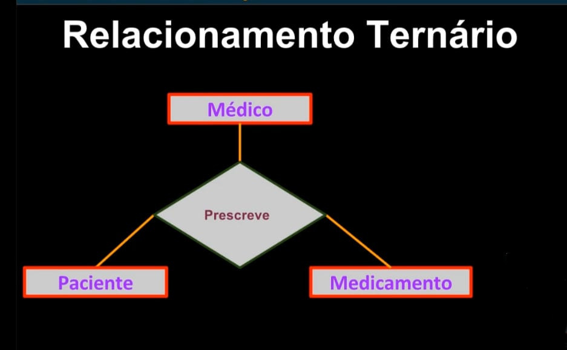

# **Relacionamento entre Tabelas**

Uma tabela é relacionada com outras tabelas. Por exemplo, um produto é vendido em uma loja.

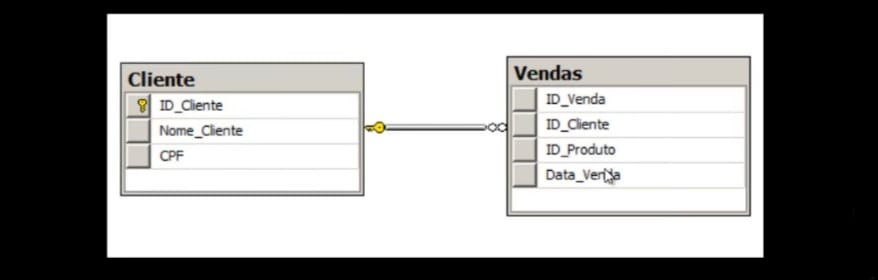

O grau de um Relacionamento indica o número de entidades envolvidas no relacionamento, como ppor exemplo unário, binário e ternário.

# **Efetuando relacionamento entre múltiplas tabelas**

 - Cada linha de dados em uma tabela deve ser identificada de forma única usando-se uma Chave Primária (identificador exclusivo).
 - Usamos uma Chave Estrangeira para relacionar os dados entre múltiplas tabelas.
 - Usamos para isso o relacionamneto entre chave primária de uma tabela com a chave estrangeira em outra tabela.

# **Chaves**

Uma chave consiste em uma ou mais colunas de uma relação cujos valores são usados para identificar de forma exclusiva uma linha ou conjunto de linhas.

Pode ser única (identifica uma única linha) ou não única (identifica um conjunto de linhas).

Únicas (Unique): Candidata, Composta, Primária, Surrogada.
Não única (Non_Unique): Estrangeira.

# **Chave Candidata**

 - Atributo ou grupo de atributos com o potencial para se tornarem uma chave primária.
 - Uma chave candidata que não seja usada como chave primária será considerada com  **Chave Alternativa**.
Ex.: Campos Num_Matrícula e CPF em uma tabela podem ter registros de alunos.

# **Chave Primária**

 - Chave candidata escolhida para ser a chave *principal* na relação.
 - Identifica de forma *exclusiva* os registros em uma tabela, não podendo ter repetição de valores nem tampouco valor nulo.
 - Primary key / PK.

# **Chave Estrangeira**

 - Coluna de uma tabela que estabelece um *Relacionamento com a Chave Primária* (PK) de outra tabela.
 - É a partir da chave estrangeiraa (Foreign Key / FK) que sabemos com qual registro em outra tabela um registro está relacionado.

# **Chave Composta**

 - Chave que é composta de dois ou mais atributos (colunas).
 - Geralmente empregada quando não é possível utilizar uma única coluna de uma tabela para identificar de forma exclusiva seus registros.

# **Chave Surrogada / Substituta**

 - Valor numérico, único, adicioanado a uma relação para servir com chave primária.
 - Não possui significado para os usuários e geralmente fica escondida nas aplicações.
 - As chaves substitutas são frequentemente usadas no lugar de uma chave primária composta.

# ***Instruções para criação de chaves primárias e estrangeiras***

 - Não é possível haver valores duplicados em uma chave primária.
 - No geral, não é possível alterar o valor de uma chave primária.
 - Chaves estrangeiras são baseadas em valores de dados, classificadas como ponteiros lógicos.
 - Um valor de uma chave estrangeira deve corresponder a um valor existente em uma chave primária associada ( ou valor de chave única). Caso contrário, deve ser nulo (NULL).
 - Uma chave estrangeira deve referenciar uma chave primária ou uma coluna de chave única.

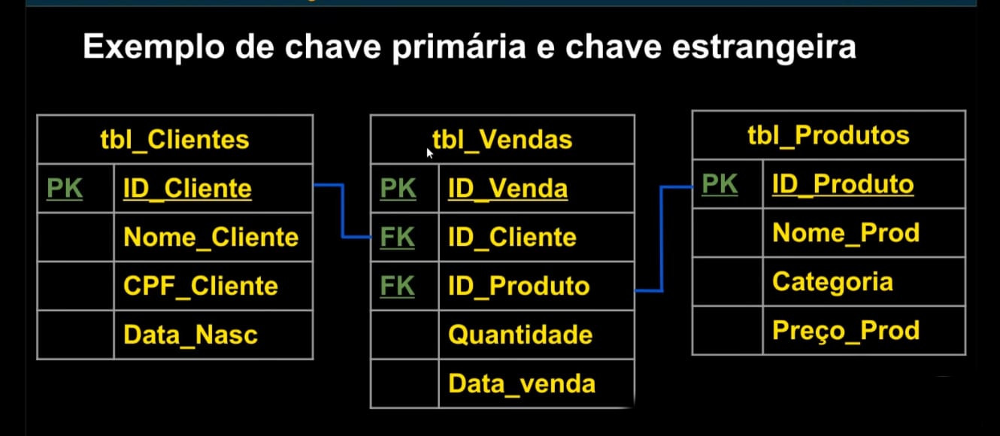

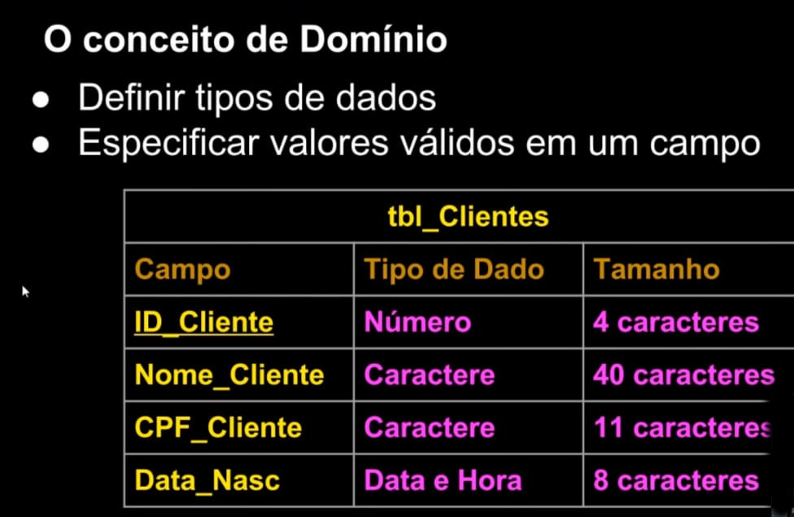

# **Cardinalidades**

A cardinalidade diz respeito ao número de itens que se relacionam nas entidades.
A cardinalidade pode ser máxima ou mínima, significando respectivanmente os números mínimo e máximo de instâncias de cada entidade associadas no relacionamento.

Cardinalidade Máxima: trata-se do número máximo de instâncias de entidades que podem participar em um relacionamento. 

Pode ser 1 ou N (muitos).

Cardinalidade Mínima: número mínimo de instâncias de entidade que devem obrigatoriamente participar em um relacionamento; zero é participação opcional e um é obrigatória.

# **Simbologia para Cardinalidades**

# **Simbologia para Cardinalidade**

 
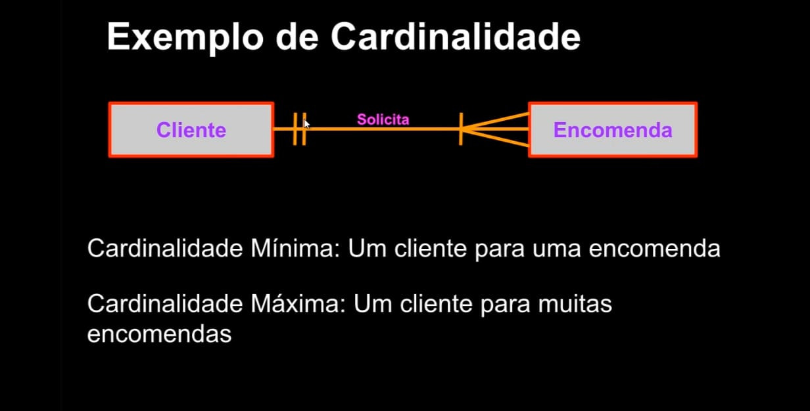
 

# **Relacionamento Binário um-para-um 1:1**

Uma instância de entidade única em uma entidade está relacionada com uma instância de entidade única em outra entidade.

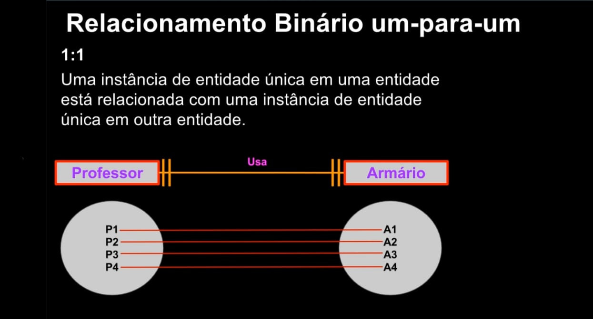

# **Relacionamento Binário um-para-muitos 1:N**

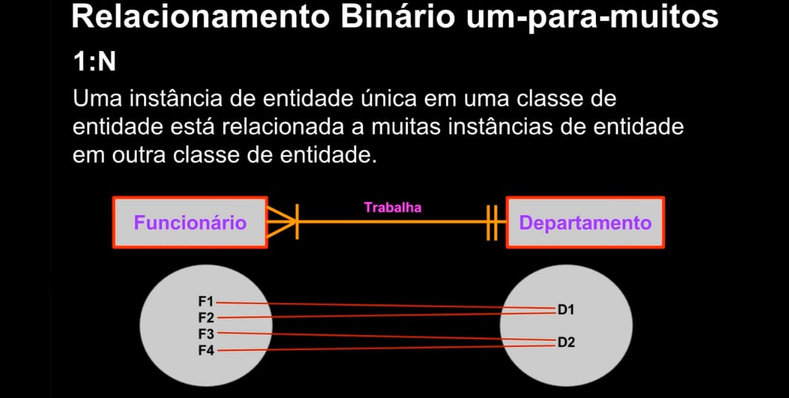

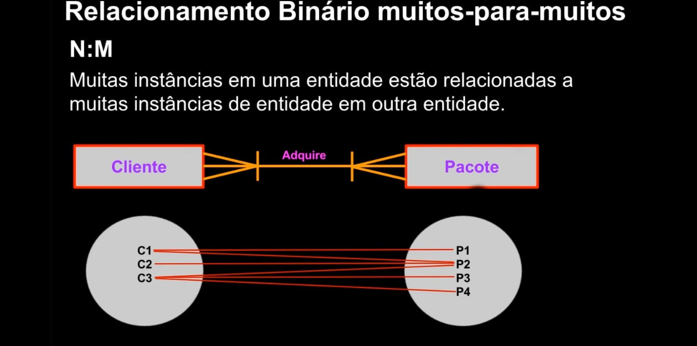

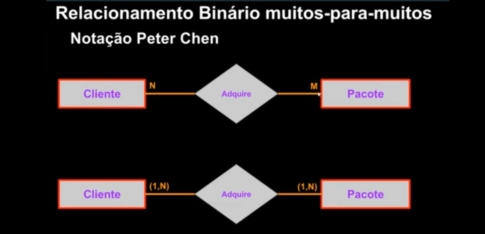

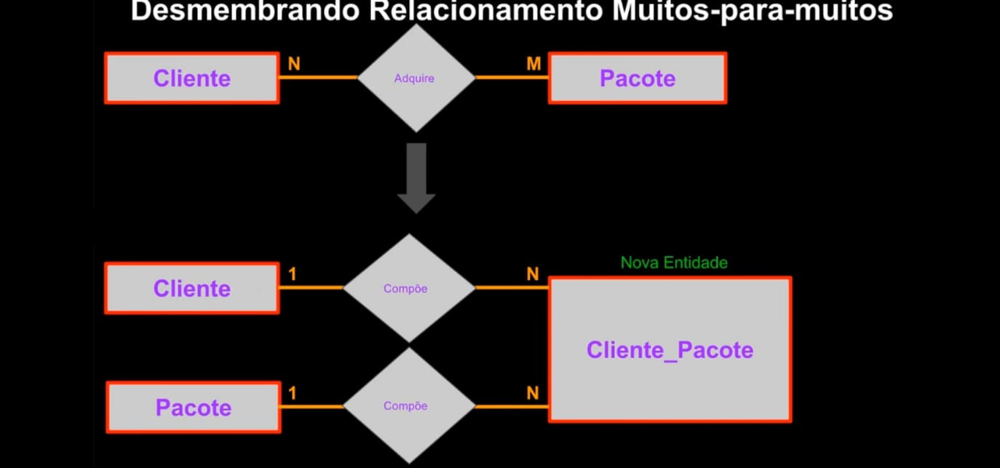

# **Restrinções de integridade**

Integridade de Dados

Manutenção e garantia da consistência e precisão dos dados, sendo um aspecto crítico no design, implementação e uso de sistemas de armazenamento de dados.

A integridade é atingida por meio da aplicação de *Restrições de Integridade*

# **Restrições de Integridade**

 - Integridade Referencial.
 - Integridade de Domínio.
 - Integridade de Vazio.
 - Integridade de Chaves.
 - Integridade Definida pelo Usuário.
  
# **Integridade de Domínio**

Valores inseridos em uma coluna devem sempre obedecer à definição dos valores que são permitidos para essa coluna - os valores do *domínio*.

EX.: em uma coluna que armazena preços de mercadorias, os valores admitidos são do tipo domínio numérico - ou seja, apenas números.

# **Integridade de Domínio - Fatores**

 - Tipo de Dado do campo.
 - Representação interna do tipo de dado.
 - Presença ou não do Dado.
 - Intervalos de valores no domínio.
 - Conjuntos de valores discretos.
  
Ex.: Atributo *Preço do Produto*: Valor Monetário

 - Valor permitido:
   -  25,33
 - Valores não permitidos:
   -  25 Reais e 33 centavos
   - -32,33

# **Integridade Referencial**

Uma restrição de Integridade Referencial assegura que valores de uma coluna em uma tabela são válidos baseados nos valores em outra tabela relacionada.

Ex.: Se um produto de ID 523 foi cadastrado em uma tabela de Vendas, então um produto com ID 523 deve existir na tabela de Produtos relacionada.

Atributo *Nome_Produto*: Caracteres
 - Valores permitidos (produtos cadastrados):
   - Água
   - Refrigerante
   - Suco
 - Valores não permitidos para venda (não existentes na tabela de produtos):
   - Cerveja
  

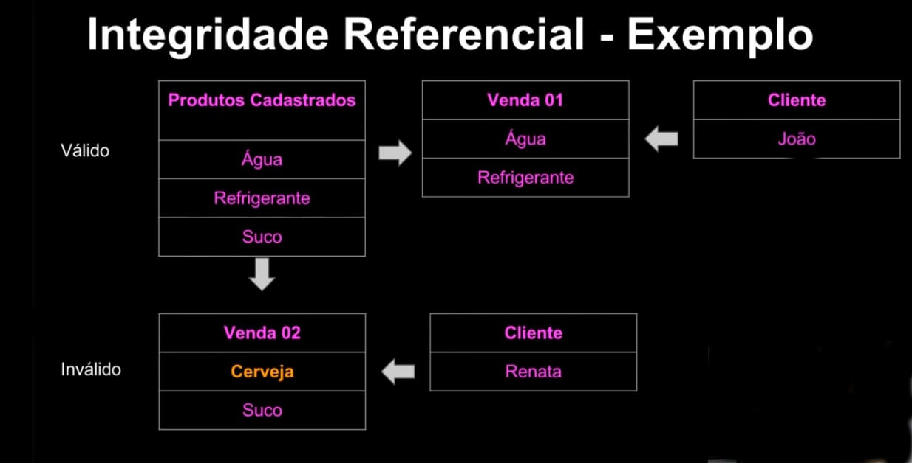

# **Integridade Referencial - Atualização e Exclusão**

Se um registro for excluído em uma tabela, então os registros relacionados em outras tabelas que o referenciam talvez precisem ser excluídos.
Caso contrário ocorrerá erro.
O mesmo se dá com atualização de registros.

# **Integridade de Vazio**

Este tipo de integridade informa se a coluna é obrigatória ou opcional - ou seja, se é possível não inserir um valor na coluna.
Uma coluna de chave primária, por exemplo, sempre deve ter dados inseridos, e nunca pode estar vazia, para nenhum registro.

# **Valores Nulos (NULL)**

Um valor NULL significa que não exeistem dados.
É diferente de zero, espaço, string vazia ou tabulação.
Os nulos podem ser problemáticos, pois indicam:
 - O valor da coluna não é apropriado;
 - O valor não foi inserido;
 - O valor é desconhecido.
  
Ex.: Suponha uma tabela de cadastro de alunos.
Todo aluno deverá ter um nome cadastrado, de modo que esse campo é obrigatório (atributo não-nulo)
Nem todo aluno possui telefone, portanto esse campo não é obigatório (atributo nulo), permite que deixe esse campo sem nada, o campo fica vazio, desde que seja previsto na modelagem.

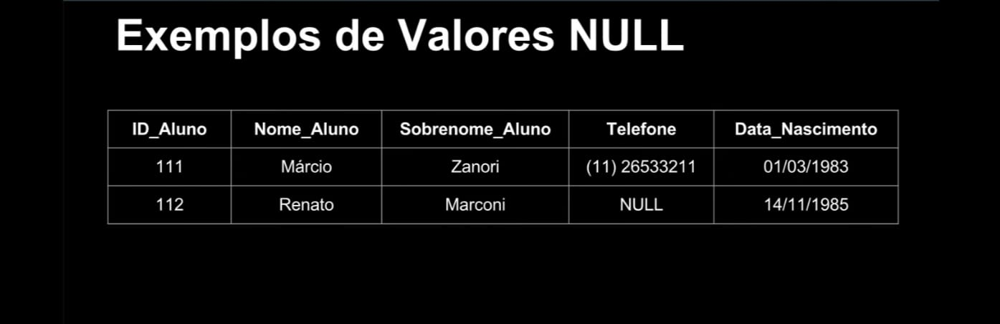

# **Integridade de Chave**

Os valores inseridos na coluna de chave primária (PK) devem ser sempre únicos, não admitindo-se repetições nesses valores.
Desta forma, as tuplas (registros) serão sempre distintos.
Os valores de chave primária também não podem ser nulos.

# **Integridade Definida pelo Usuário**

Diz respeito a regras de negócio específicas que são definidas pelo usuário do banco de dados.
Por exemplo, pode-se definir que uma coluna somente aceitará um conjunto restrito de valores.

# **Notações Gráficas e Diagramação**

 - O Diagrama Entidade Relacionamento é a representação gráfica de um MER, que é um modelo conceitual.
 - O uso de um diagrama facilita a modelagem e a comunicação entre os membros da equipe de desenvolvimento, permitindo que todos falem a mesma "língua" durante o processo.
 - A notação original do DER foi proposta por Peter Chen.
  
Exitem vários métodos para representar relacionamentos entre entidades.
As notações gráficas mais utilizadas em modelagem de dados são:
 - IDEF1X
 - Bachman
 - Min-Max
- Pé de Galinha (Crow's Foot)
- Martin
- UML
- Peter Chen

# **Diagramação**

Os mais comuns é utilizar o Diagrama de Peter Chen( utilizado nas escolas de forma acadêmica) ou Pé de Galinha(muito comum no mercado).

# **Softwares para Diagramação**

Ferramentas CASE:

 - Astah
 - Lucidchart
 - erwin Data Modeler
 - ERDPlus
 - GenMyModel
 - Star UML
 - Microsoft Visio
 - MySQL Workbench
 - Visual Paradigm
  
# **Diagramação - Peter Chen**

A notação de Peter Chen para DER utiliza retângulos para representar Entidades, e losangos para os Relacionamentos. Atributos são representados por elipses.

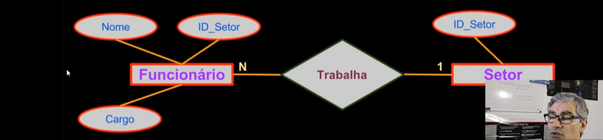

# **Diagramação: Pé-de-galinha (Crow's Foot)**

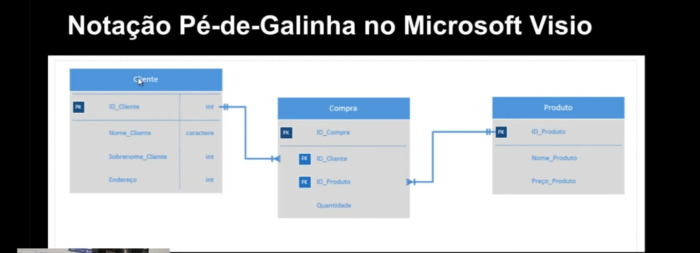

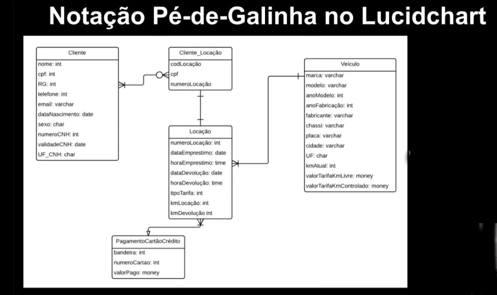

# **Dicionário de Dados**

 - Um dicionário de dados é um documento usado para armazenar informações sobre o conteúdo, formato e a estrutura de um banco de dados, assim como os relacionamentos entre os seus elementos.
 - É importante manter um dicionário de dados para limitar erros ao criar a estrutura física do banco de dados no computador.
 - Também chamado de "Repositório de Metadados"
  
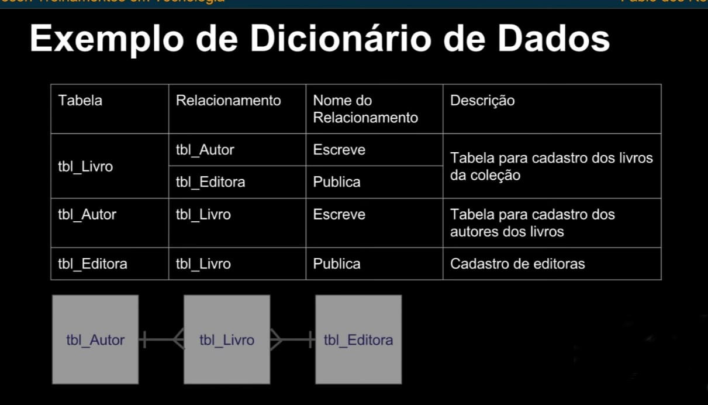

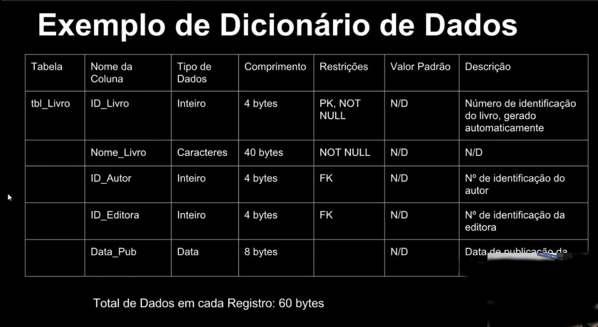

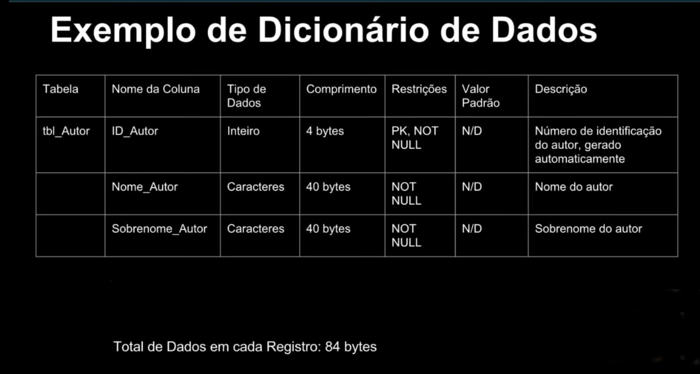

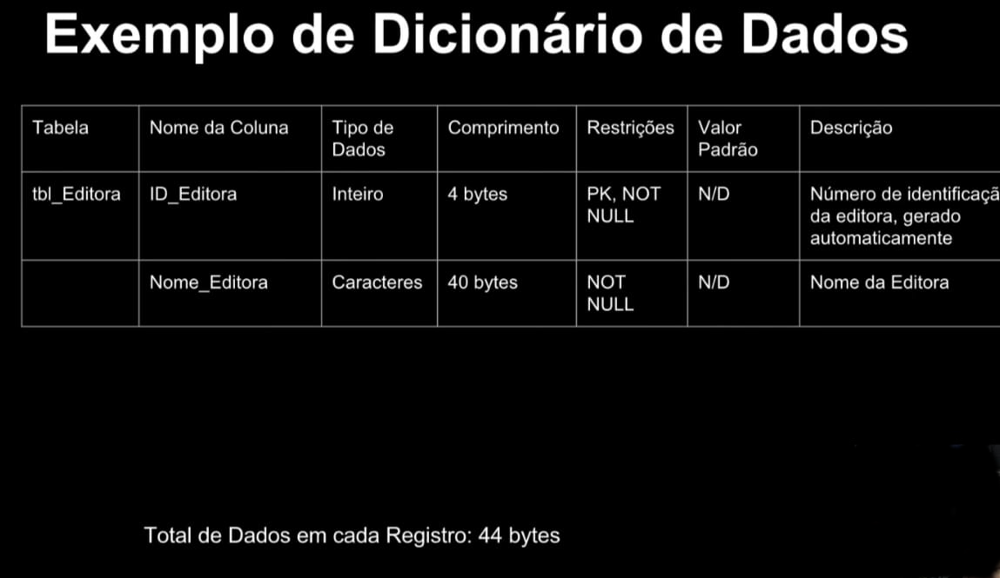

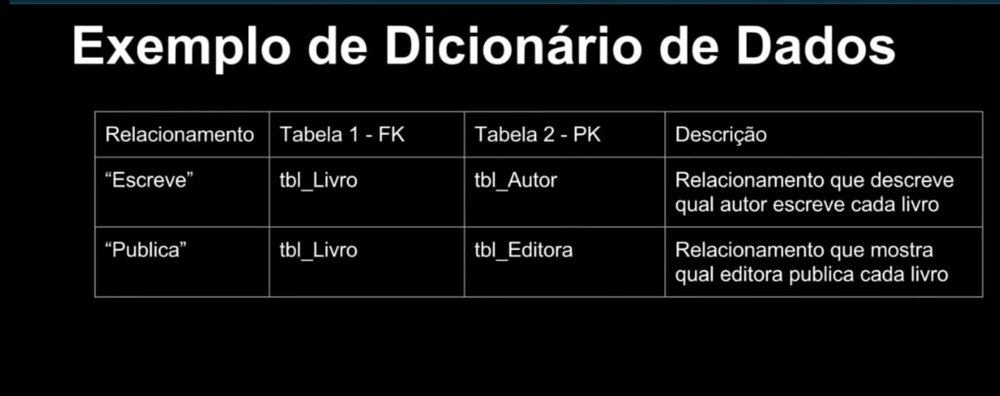

# **Dependências**

Dependência Funcional:

Seja E uma entidade, e X e Y dois atributos quaisquer de E. Dizemos que Y é funcionalmente dependente de X se e somente se cada valor de X tiver associado a ele exatamente um valor de Y.
Simbolicamente: 

   X ---> Y

Que lemos com "X determina funcionalmente Y".

# **Dependência Funcional**

Ex.: O prazo de entrega de um pedido depende do número do pedido considerado:

   Num_Pedido -------> Prazo_Entrega_Pedido    

O atributo que determina o valor é chamado de *Determinate*.
O outro atributo é chamado de *Dependente*
Uma chave primária em uma relação determina funcionalmente todos os outros atributos não-chave na linha.

# **Dependência Funcional Total**

Em uma relação com uma PK composta, um atributo não-chave que dependa dessa PK como um todo, e não somente de parte dela, é dito como posssuindo Dependência Funcional Total.

# **Dependência Funcional Total - Exemplo**

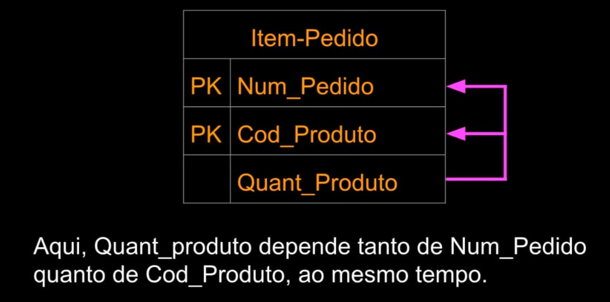

Aqui, Quant_Produto depende tanto de Num_Pedido quanto de Cod_  produto, ao mesmo tempo.

# **Dependência Funcional Parcial**

Uma dependência funcional é parcial quando os atributos não-chave não dependem funcionalmente de toda a PK quando esta for composta.
Ou seja, existe uma dependência funcional, mas somente de uma parte da chave primária.

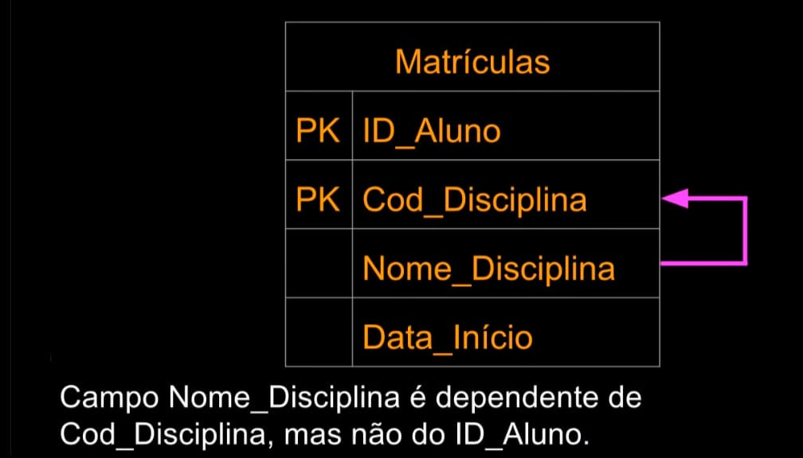

# **Dependência Funcional Transitiva**

Ocorre quando um campo não depende diretamente da chave primária da tabela ( nem mesmo parcialmente), mas depende de um outro campo não-chave.

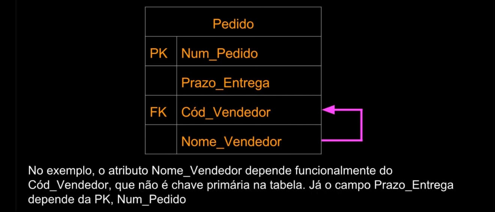

*O Nome_Vendedor provavelmente deverá sair desta tabela.*

# **Dependência Multivalorada**

Ocorre quando, para cada valor de um atributo A, existe um conjunto de valores para outros atributos B e C que estão associados a ele, mas não independente entre si.
Representamos a dependência multivalorada assim:
                            
  A ->> B

Onde B é a coluna que depende de A.

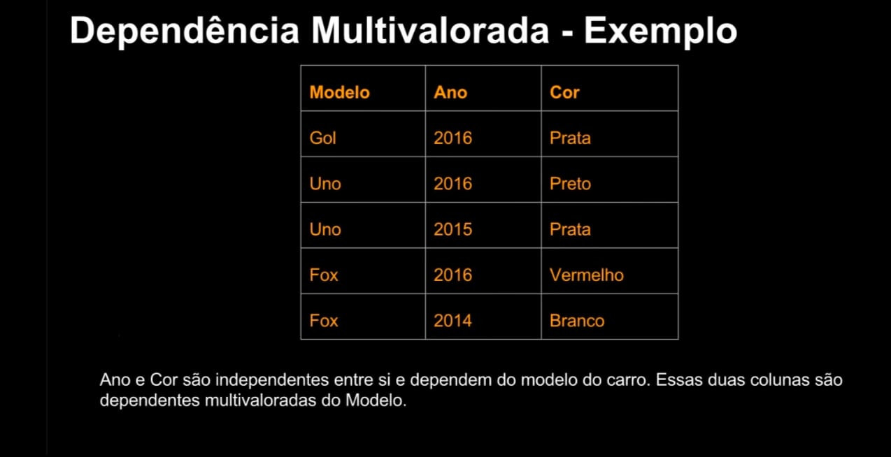

# **Anomalias de Atualização**

 - Anomalias são problemas que ocorrem em banco de dados mal planejados e não-normalizados, geralmente ocorrendo por excesso de dados armazenados em uma mesma tabela.
 - São causadas pelas dependências parciais e trnsitivas.
 - As anomalias de atualização são classificadas em anomalias de inserção, de exclusão e de modificação.

# **Anomalia de Inclusão**

Anomalia de Inclusão: não deve ser possível adicionar um dado a não ser que outro dado esteja disponível.
Por exemplo, não deve ser permitido cadastrar um novo livro sem que um autor já esteja cadastrado.

# **Anomalia de Exclusão**

Anomalia de Exlusão: ao excluirmos um registro, dados referentes em outra tabela são excluídos. Por exemplo, se excluirmos um autor, os livros desse autor devem ser excluídos também.

# **Anomalia de Modificação**

Anomalia de Modificação: ao alterar um dado em uma tabela, dados em outras tabelas precisam ser alterados.
Por exemplo, se o código de um autor for modificado, esse código deve ser modificado na tabela de autores e na tabela de livros também, para manter o relacionamento entre livros e seus autores corretos.

# **Eliminar Anomalias**

Projetar os esquemas de relações (tabelas) no banco de dados de modo que nenhuma anomalia de inserção, exclusão ou modificação esteja presente nas relações.
Para isso, usamos o processo de *Normalização*.

# **Normalização**

Normalização consiste em um processo de análise de uma relação para assegurar que seja *bem formada*.
Decompor relações com anomalias para produzir relações menores e bem-estruturadas.
Ou seja, em uma relação normalizada podemos inserir, excluir ou modificar registros sem criar anomalias.

 - O processo de normalização, proposto por Codd em 1972, aplica a um esquema de relação uma série de testes para certificar que ele satisfaça uma *Forma Normal* (FN)
 - Codd propôs originalmente 3 formas normais: 1ª, 2ª e 3ª FNs.
 - Posteriormente, a 3ªFN foi revisada e uma definição mais robusta foi proposta por Boyce e Codd, denominada Forma Normal BOYCE-cDD (FNBC).

# **Objetivos da Normalização**

Analisar esquemas de relação (tabelas) com base em suas dependências funcionais e chaves primárias para:

  1. Minimizar redundâncias.
  2. Minimizar anomalias de inserção, exclusão e modificação.
   
As relações são decompostas em esquemas de relação menores que atendem aos testes de forma normalizada.

# **Objetivos da Normalização**

O ideal é que o projeto do banco de dados relacional alcance a FNBC ou a 3FN para cada tabela.
Não é adequado normalizar apenas até a 1FN ou à 2FN, pois na verdade essas formas normais são usadas para se chegar à 3FN ou FNBC.

# **Primeira Forma Normal**

Definida historicamente para reprovar atributos multivalorados, compostos e suas combinações.
O domínio de um atributo deve incluir apenas valores atômicos (indivisíveis), e o valor de qualquer atributo em uma tupla deve ser único valor do domínio desse atributo.
Uma tabela está na 1ª forma normal quando:
 - Somente possui valores atômicos.
 - Não há grupos de atributos repetidos (há apenas um dado por coluna nas linhas).
 - Existe uma chave primária.
 - Relação não possui atributos multivalorados ou relações aninhadas ( tabelas dentro de tabelas).
 - Uma tabela está na 1ª forma normal se somente houverem valores atômicos no domínio de seus atributos.
 - Um valor atômico é indivisível.
 - Como exemplo, um campo de Endereço possui subdomínios: Rua, Número e CEP. Esses itens devem ser separados no processo e normalização.
 - Cada informação deve ser colocada em um capmo diferente.

# **Dados Atômicos**

 - Elementos de dados que representam o nível mais baixo de detalhamento
 - Então, campos não-atômicos são aqueles que podem ser subdivididos em mais um campo, pois eles escondem detalhes, como por exemplo o nome de uma pessoa, que contém o primeiro nome e o sobrenome.

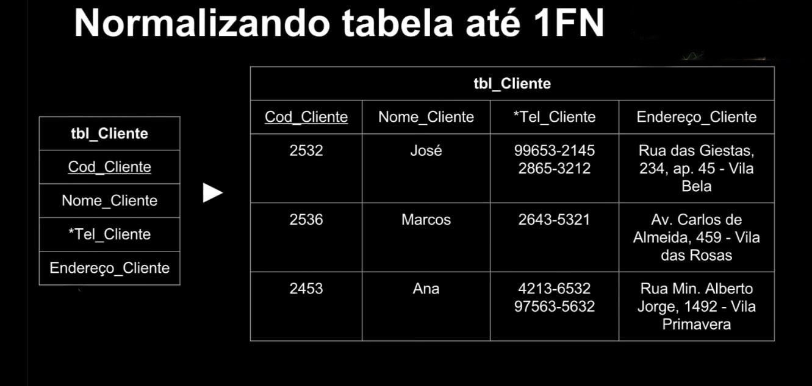

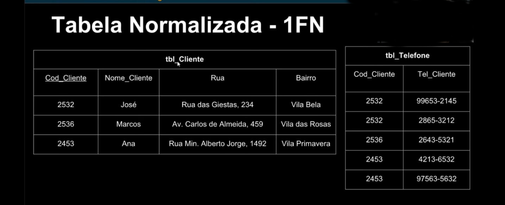

# **Segunda Forma Normal**

 - Baseada no conceito de Dependência Funcional Total.
 - Um esquema de relação R está na 2FN se cada atributo não-chave de R for total e funcionalmente dependente da PK de R.
 - Para testar a 2FN, testamos as dependências funcionais cujos atributos fazem parte da chave primária.
 - Caso a PK tenha um único atributo, esse teste precisa ser aplicado.
 - Uma tabela está na 2ª FN se:
   - Está na 1ªFN.
   - Todos os atributos não-chave são funcionalmente dependentes de *todas as partes* da chave primária.
   - Não existem dependências parciais.
   - Caso contrário, deve-se gerar uma nova tabela com os dados.
-  - *Um atributo-chave é um que é uma PK ou parte de uma PK composta*.

  Deve-se criar uma nova relação para cada PK ou combinação de atributos que forem *determinantes em uma dependência funcional*.

  Esse atributo será a PK na nova tabela.
  Mova os atributos não-chave dependentes desta PK para a nova tabela.

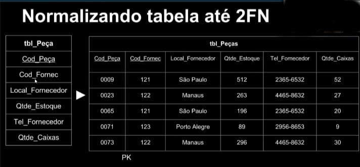

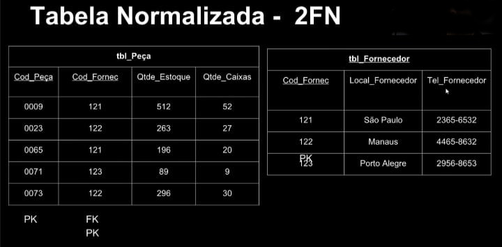

# **Terceira Forma Normal**

 - Baseada no conceito de Dependência Transitiva.
 - A relação não deve ter atributo não-chave determinado funcionalmente por outro atributo não-chave ( ou conjunto).
 - Não deve existir dependência transitiva de um atributo não-chave sobre a PK.
 - Deve-se decompor e montar uma nova relação que inclua os atributos não-chave que determinam funcionalmente outros atributos não-chave.

# **Terceira Forma Normal**

Uma tabela está na 3FN se:

 - Estiver na 2FN.
 - Não existirem *dependência transitivas* (é uma dependência funcional entre dois ou mais atributos que não sejam chaves).
 - Uma tabela está na 3FN se ela estiver na 2FN e se nenhuma coluna não-chave depender de outra coluna não-chave.

Uma dependência transitiva em uma tabela é uma dependência funcional entre dois ou mais atributos não-chave.

Para cada atributo (ou grupo) não-chave que for um determinante na relação, cria-se uma nova tabela.

Esse atributo será a PK na nova relação.

Move-se então todos os atributos que não são dependentes funcionalmente do atributo chave para nova tabela.

O atributo (PK na nova relação) fica também na tabela original, e servirá como  uma chave estrangeira para associar as duas relações.

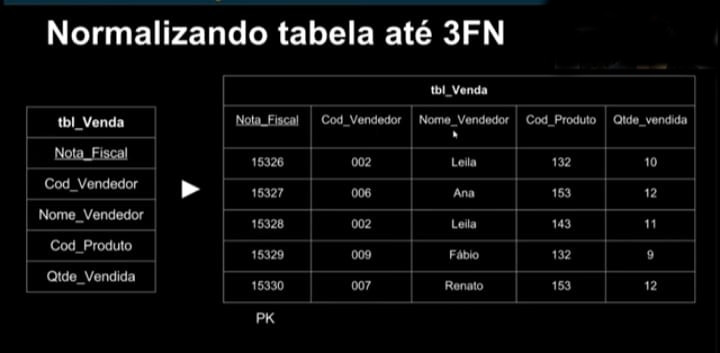

# **Passo a passo da normalização**

# **Forma Normal de Boyce-Codd**

A definição origianl da 3FN de Codd não lidava adequadamente com uma relação que:
 - Tivesse duas ou mais chaves candidatas.
 - Essas chaves candidatas fossem compostas.
 - Elas tivessem superposição (atributos em comum).

Caso a combinação das condições acima não ocorra em uma tabela, basta aplicar a 3FN.

Uma relação está em FNBC se e somente se os únicos determinantes são chaves candidatas.

 - Cada relação na FNBC também está na  3FN, mas uma relação na 3FN não está necessariamente na FNBC (a maioria está).
 - Quando uma tabela possui mais de uma chave candidata, podem ocorrer anomalias.
 - Na FNBC as chaves candidatas não possuem dependências parciais por outros atributos.
 - Uma relação R está na FNBC sempre que uma dependência FUNCIONAL NÃO-TRIVIAL  X --> A se mantivetr em R, assim X é uma superchave de R.

# **FNBC - Pontos a considerar**

Determinante: "lado esquerdo" de uma DF, como o X em X --> Y (Y é "dependente"); X determina funcionalmente Y.

Dependência Funcional Trivial: dependência que não pode deixar de ser satisfeita. 
Uma DF é trivial se o lado direito da expressão é um subconjunto da do lado esquerdo.

A --> B é uma DF trivial se B for um subconjunto de A.

Exemplo:

{ID_Func, Nome_Func} --> ID_Func é uma DF trivial porque ID_Func é um subconjunto de {ID_Func, Nome_Func}

# **Forma Normal de Boyce-Codd**

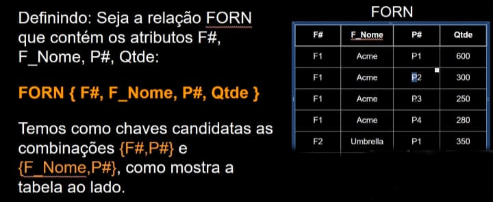

# **FNBC - Normalizando**

Para normalizar uma tabela até a FNBC devemos decompor a tabela com os passos a seguir:

 - Encontrar uma dependência funcional não-trivial X --> Y  que viole a condição de FNBC ( X não deve ser uma superchave).
 - Dividir a tabela em duas: uma co os atributos XY,ou seja, todos os atributos da depedência.
 - Outra com os atributos X juntamente com os atributos restantes da tabela original.

# **Resolvendo o Problema**

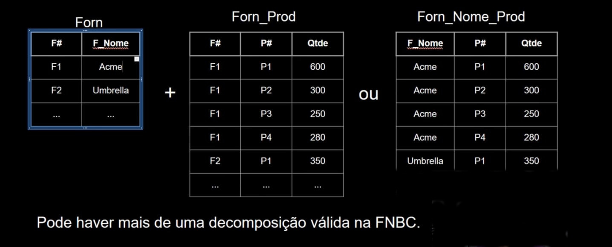

# **FNBC - Exemplo 2 (não normalizado)**

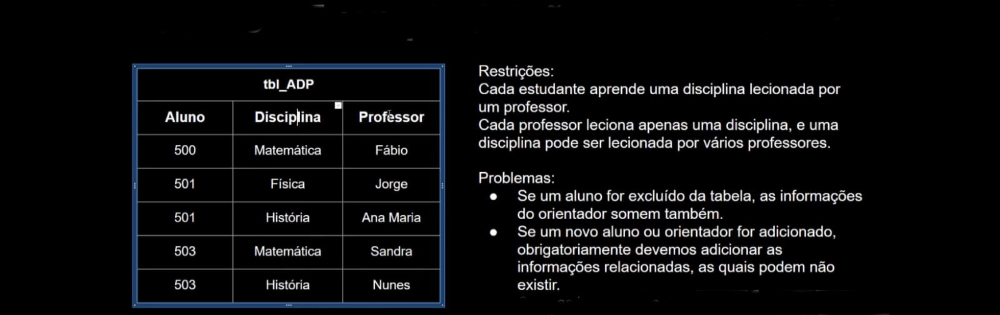

 - Se as informações de um aluno for atualizadas, deveremos atualizar também as informações sobre o orientador.
 - Disciplina é a parte de uma chave candidata composta e é determinado por um atributo não-chave da tabela.

# **FNBC - Normalizado**

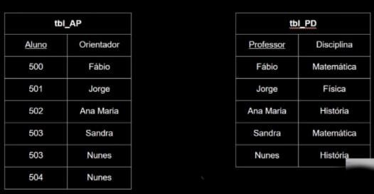

# **As 12 Regras de Codd para SGBDR**

 - As doze regras de Codd são um conjunto de treze regras (enumeradas de zero a doze) publicada pelo cientista da computação Edgar F. Codd na revista Computerworld em outubro de 1965.
 - Seu intuito é definir o que é necessário para que um sistema de gerenciamento de banco de dados possa ser considerado realmente relacional, ou seja, um SGBDR.
 - Edgar Freank "Ted" Codd (19 de agosto de 1923 - 18 de abril de 2003) foi um cientista da computação inglês.
 - Enquanto trabalhava para a IBM, inventou o modelo relacional para gerenciamento de banco de dados, a base teórica para banco de dados relacionais e sistemas de gerenciamento de banco de dados relacionais.
 - Entidade e Relacionamento inventou o modelo Entidade e Relacionamento (Peter Chen).

# **O Porquê das 12 Regras de Codd**

 - Conforme o modelo relacional se popularizou no início dos anos 1980, Codd iniciou uma campanha para evitar que o termo fosse mal utilizado por foenecedores de bancos de dados que apenas acrescentavam uma "pitada" de relacional à tecnologias antigas.
 - Como parte desta campanha, ele publicou suas 12 regras para definir o que constuía um banco de dados relacional.
 - Isso complicou sua posição na IBM, e ele estão saiu para formar uma empresa de consultoria com Christopher J. Date e outros.

# **As 12 Regras de E.F Codd**

# **Regra 0: A Regra fundamental**

Para qualquer sistema anunciado como, ou que alega ser um sistema de gerenciamento de banco de dados relacional, esse sistema deve ser capaz de gerenciar bancos de dados inteiramente por meio de suas capacidades relacionais.
 - Todas as 12 regras são motivadas pela Regra Zero definida acima.

# **Regra 1: A Regra da informação**

Todas as informações em um banco de dados relacional são representadas explicitamente no nível lógico e exatamente de uma maneira - por valores em tabelas.

 - Um banco de dados contém deversas informações, incluindo dados que os usuários acessam e também metadados, e essas informações devem ser armazenadas em cada célula de uma tabela na forma de intersecções entre linhas e colunas.

# **Regra 2: Regra de acesso garantido**

É garantido que todo e qualquer dado (valor atômico) em um banco de dados relacioanl seja logicamente acessível recorrendo a uma combinação de nome de tabela, valor de chave primária e nome de coluna.

# **Regra 3: Tratamento sistemático de nulos**

Valores nulos (distintos da sequência de caracteres vazio ou de uma sequência de caracteres em branco e distintos de zero ou qualquer outro número) são suportados em SGBDs totalmente relacionais para representar informações ausentes e informações inaplicáveis de forma sistemática, independente do tipo de dados.

# **Regra 4: Regra do Catálogo on-line dinâmico**

A dscrição do banco de dados é representada no nível lógico da mesma forma que os dados comuns, de modo que os usuários autorizados possam aplicar à sua interrogação a mesma linguagem relacional que aplicam aos dados regulares. São os metadados que devem ser gerenciados e armazenados como dados comuns, ou seja, em tabelas também dentro de bancos de dados, mas precisamente em catálago de bancos de dados, e esses dados devem estar autorizados para uma consulta padrão por uma liguagem que pode ser por exemplo o SQL.

# **Regra 5: Sublinguagem Abragente de Dados**

O sistema necessita suportar ao menos uma linguagem relaciona que:

 1. Possua uma sintaxe linear;
 2. Possa ser utilizada seja interativamente, seja por meio de programas;
 3. Suporte operações de definição de dados (incluindo definições de Visualizações);
 4. Suporte operações de manipulação de dados (atualização, bem como recuperação), de segurança e restrições de integridade, e transação; operações de gerenciamento (begin, commit e rollback).

# **Regra 6: Atualizações de Visualizações**

Todas as visões (tabelas de visualizações) que são teoricamente atualizáveis também são atualizáveis pelo sistema.
 - "Atualização" inclui inserção e exclusão, bem como modificação.

# **Regra 7: Inserção, Atualização, e Exclusão de Alto nível**

A capacidade de tratar uma relação base ou uma relação derivada como um único operando aplica-se não apenas à recuperação de dados, mas também à inserção, atualização e exclusão de dados.

 - O sistema necessita fornecer suporte à configuração do nível de operações de insert, update, e delete.

# **Regra 8: Independência Física dos dados**

Os programas aplicativos e as atividades do terminal permanecem logicamente inalterados sempre que qualquer alteração é feita nas representações de armazenamento ou nos métodos de acesso.

 - Todos os dados armazenados em um banco de dados ou aplicativos devem ser fisicamente independentes ao acessar o banco de dados.
 - Cada dado não deve depender de outros dados ou de uma aplicação.

# **Regra 9: Independência Lógica dos Dados**

Os programas aplicativos e as atividades de terminal permanecem logicamente intactos quando alterações de qualquer tipo que preservem informações e que teoricamente permitam a integridade são feitas nas tabelas base.

 - Similar à independência física dos dados.
 - Se ocorrer alguma alteração no nível lógico (estruturas de tabelas), isso não deverá afetar a visualização do usuário (aplicação).

# **Regra 10: Independência da Integridade**

As restrições de integridade específicas de um banco de dados relacional em particular devem ser definidas na sublinguagem de dados relacionais e armazenáveis no catálogo, e não nos programas aplicativos.

 - Integridade de entidade: nenhum componente de uma chave primária pode ter valor.
 - Integridade referencial: para cada valor de chave estrangeira não nulo distinto em um BD relacional, deve existir um valor de chave primária correspondente do mesmo domínio.

# **Regra 11: Independência de Distribuição**

Um SBGD relacional possui independência de distribuição.
A distribuição de partes do SBGD em várias localidades deve ser transparente para os usuários do banco de dados. Aplicações existentes necessitam continuar a operar com sucesso.

  1. Quando uma versão distribuída do SBGD é introduzida pela primeira vez, e
  2. Quando dados distribuídos existentes são redistribuídos em outras localidades físicas.

# **Regra 12: Regra de Não-Subversão**

Se um sistema relacional tiver uma linguagem de baixo (registro único po vez), esse baixo nível não pode ser usado para subverter ou contornar as regras e restrinções de integridade expressas na linguagem relacional de nível superior (múltiplos registros por vez).
 - Se a interface do sistema fornece acesso a registros de baixo nível, então a interface não deve ser capaz de danificar o sistemas e controlar restrições de segurança e integridade.

# **Conclusão**

Se um sistema de gerenciamento de banco de dados segue essas regras, ele será considerado um banco de dados relacional verdadeiro.
Atualmente essas regras podem ser complementadas pelo Terceiro Manifesto, de CJ Date e Hugh Darwen. 
Acesso: http://thethirdmanifesto.com .

  

