# **Apresentação**

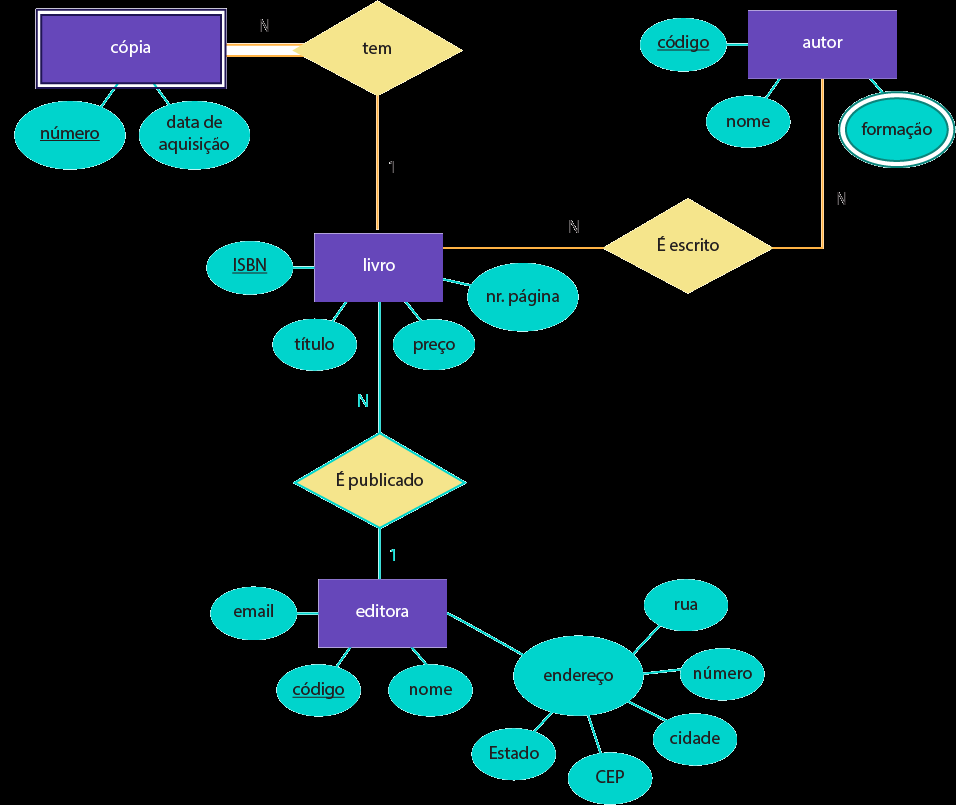

Banco de Dados para gerenciamento de uma Faculdade.

Objetivos do Banco de Dados:

 - Realizar o controle centralizado de alunos, professores, cursos, disciplinas, histórico e turmas.

# **Fases do projeto**

Fases:

 - Levantamento dos Requisitos
 - Identificação de Entidades e Relacionamentos
 - Modelo E-R
 - Diagrama E-R
 - Dicionário de Dados
 - Normalização
 - Implementação (Usando o MySQL)
 - Testes Básicos (Consultas)

# **Regras de Negócio**

 - Um aluno só pode estar matriculado em um curso por vez
 - Alunos possuem um código de identificacão (RA)
 - Cursos são compostos por disciplinas
 - Cada disciplina terá no máximo 30 alunos por turma
 - As disciplinas podem ser obrigatórias ou optativas, dependendo do curso
 - As disciplinas pertncem a departamentos específicos
 - Cada disciplina possui um código de identificação
 - Alunos podem trancar matrícula, não estando então matriculados em nenhuma disciplina no semestre
 - Em cada semestre, cada aluno pode se matricular em no máximo 9 disciplinas
 - O aluno só pode ser reprovado no máximo 3 vezes na mesma disciplina
 - A faculdade terá no máximo 3.000 alunos matriculados simultaneamente, em 10 cursos distintos
 - Entram 300 alunos novos por ano
 - Existem 90 disciplinas no tital disponíveis
 - Um histórico Escolar traz todas as disciplinas cursadas por um aluno, incluindo nota fianl, frequência e período do curso realizado
 - Professores podem ser cadastrados mesmo sem lecionar disciplinas
 - Existem 40 professores trabalhando na escola
 - Cada professor irá lecionar no máximo 40 disciplinas diferentes
 - Cada profesor é vinculado a um departamento
 - Professores são identificados por um código de professor.

# **Identificando as Entidades, Atributos Relacionamentos**

Objetivos do Banco de Dados:

 - Realizar controle centralizado de alunos, professores, cursos, disciplinas, histórico escolar e turmas.

# **Identificando as Entidades**

 - Aluno
 - Professor
 - Disciplina
 - Curso
 - Departamento

# **Identificando os Relacionamentos**

 - Aluno está matriculado em Curso
 - Aluno Cursa Disciplina
 - Aluno Realizou Disciplina
 - Disciplina Pertence a Curso
 - Professor Ministra Disciolina
 - Professor Pertence a Departamento
 - Departamento é Responsável por Disciplina
 - Departamento Controle Curso
 - Disciplina Depende de Disciplina.

# **Identificando os Atributos - Aluno**

 - Número de Matrícula
 - Nome
 - Sobrenome
 - Endereço
    - Rua
    - Número
    - Bairro
    - CEP
    - Cidade
    - Estado
 - Código do Curso

# **Identificando os Atributos - Professor**

 - Código do Professor
 - Nome
 - Sobrenome
 - Código do Departamento

# **Identificando os Atributos - Disciplina**

 - Código da Disciplina
 - Nome da Disciplina
 - Descrição Curricular
 - Código do Departamento
 - Número de Alunos

# **Identificando os Atributos - Curso**

 - Código do Curso
 - Nome do Curso
 - Código do Departamento

# **Identificando os Atributos - Departamento**

 - Código do Departamento
 - Nome do Departamento

# **Atributos da Entidade Curso**

| Curso | 
|-----------|
| Cod_Curso    | 
| Nome_Curso   | 
| Cod_Departamento |           

# **Ferramenta brModelo 3.0**

Funcionalidades
 - Modelagem de banco de dados: criar modelos de banco de dados relacionais
 - Geração de scripts: gerar scripts SQL para criar o banco de dados
 - Edição de modelos: editar e personalizar modelos de banco de dados

Uso
 - Desenvolvimento de banco de dados: criar e gerenciar bancos de dados
 - Análise de sistemas: analisar e modelar sistemas de informação

Vantagens
 - Facilidade de uso: interface intuitiva e fácil de usar
 - Produtividade: aumenta a produtividade no desenvolvimento de banco de dados
  
sis4.com/brmodelo/

# **Atributos da entidade Professor**

| Professor |
|-----------|
| Cod_Professor | 
| Nome_Professor | 
| Cod_Departamento   | 
| Status       | 
       

# **Atributos da entidade Aluno**

| Aluno    | 
|--------------|
| RA           | 
| Nome_Aluno   | 
| Endereço      | 
| Cod_Curso    | 
| *Telefone    | 
| CPF    | 
| Status          | 
| Filiação     | 
| Sexo  | 
| Contato  |
| Cod_Turma    | 

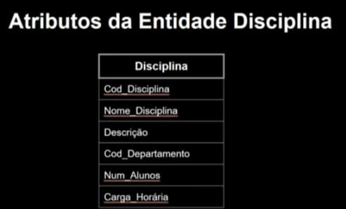

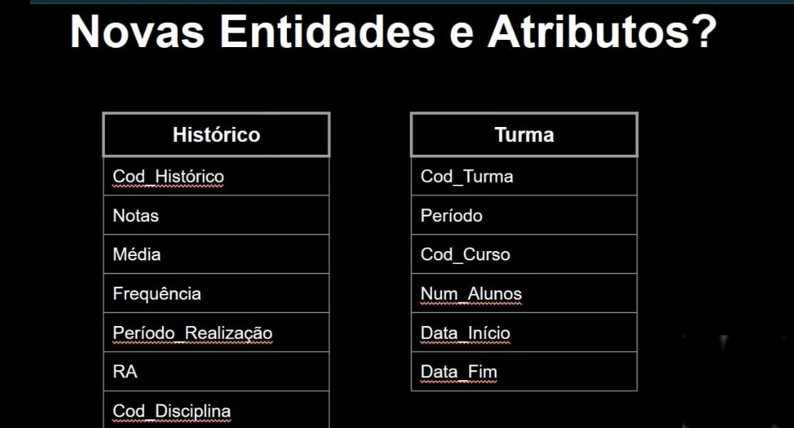

# **Novas Entidades e Atributos**

| Histórico |               
|-----------|               
| Cód_Histórico |           
| Notas |                   
| Média |                   
| Frequência |              
| Período_Realização |      
| RA           |            
| Cod_Disciplina | 

| Turma |
|------------|
| Cod_Turma |
| Período  |
| Cod_Curso |
| Nom_Alunos |
| Data_Início |
| Data_Fim |

# **Atributos da entidade Curso**

| Curso | 
|--------------|
| Cod_Curso    |  
| Nome_Curso   | 
| Cod_Departamento |

# **DER Cardinalidades**

# **Entidade Associativa** 

Uma Entidade Associativa é implementada para resolver um relacionamento muitos-para-muitos (N:M).
Gera uma tabela associativa, que permite mapear duas ou mais tabelas fazendo referência às chaves primárias de cada tabela.
Contém chaves estrangeiras, cada uma em um relacionamento um-para-muitos da tabela de junção para as tabelas de dados individuais.
Sua chave primária, no geral, é composta a partir das colunas de chaves estrangeiras em si.
Uma tabela associativa também pode ser chamada de: Tabela de Referência Cruzada, Tabela de Intersecção, Tabela de Junção, Tabela de Mapeamento, Tabela de Transição, ou ainda outros nomes.

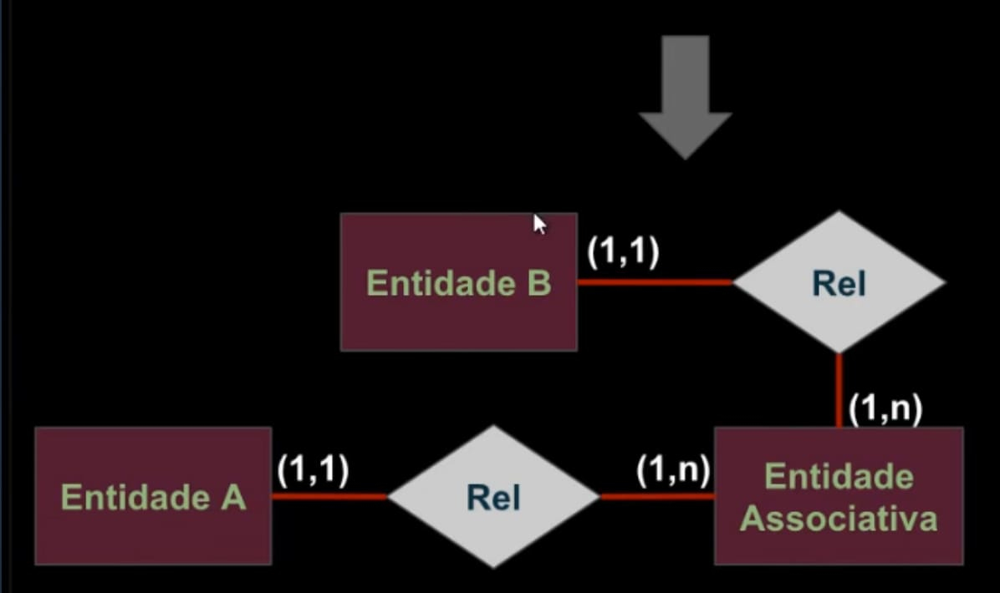

# **Relacionamentos N:M**

 - Curso Pertence Disciplina.
 - Disciplina Compõe Histórico.
 - Professor Ministra Disciplina.

Precisamos gerar Entidades Associativas para os relacionamentos Pertence, Compõe e Ministra.

# **DER INTERMEDIÁRIO - Após criar as entidades asociativas**

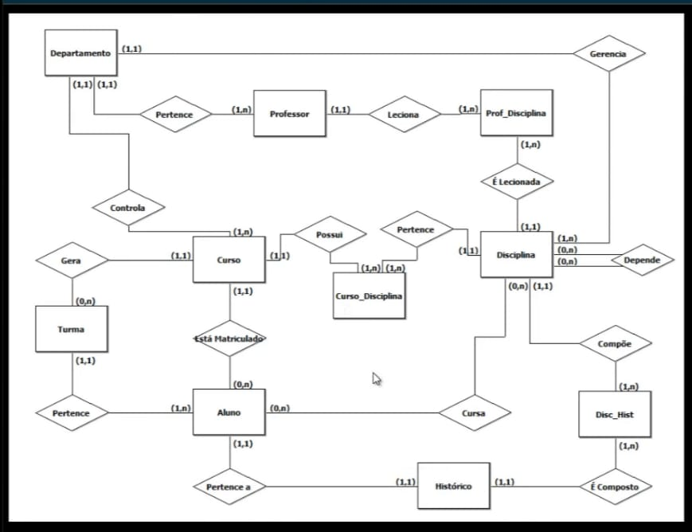

# **Criar um dicionário de Dados**

# **Fases do Projeto**

Fases:

 - Levantamento dos Requisitos;
 - Identificação de Entidades e Relacionamentos;
 - Diagrama E-R: Cardinalidades;
 - Diagrama E-R: Eliminando N:M;
 - *Dicionário de Dados*;
 - Modelo Lógico;
 - Normalização;
 - Implementação;
 - Testes Básicos.

# **Dicionário de Dados: Entidades**

# **Dicionário de Dados: Atributos**

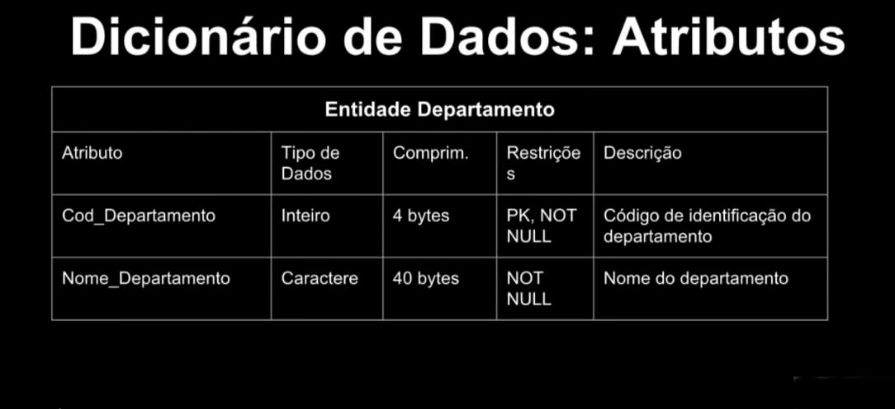

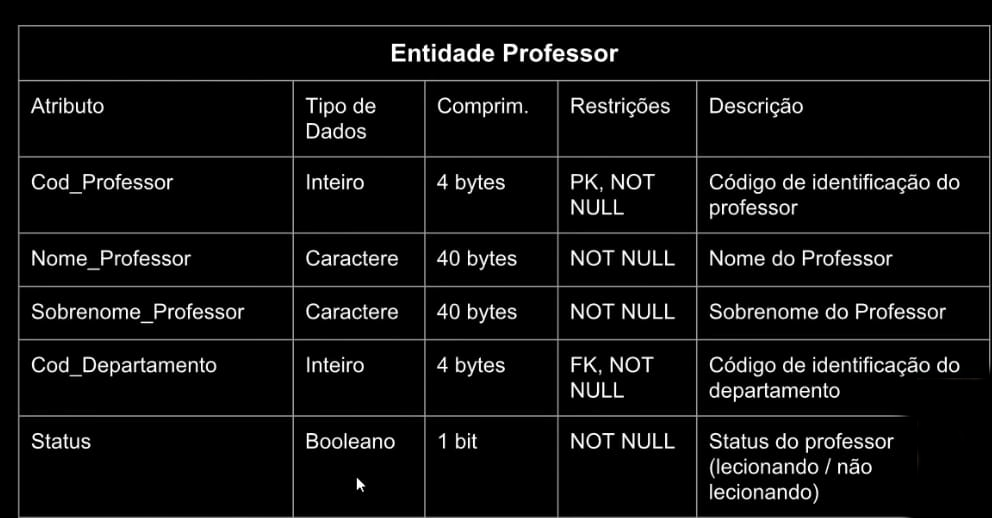

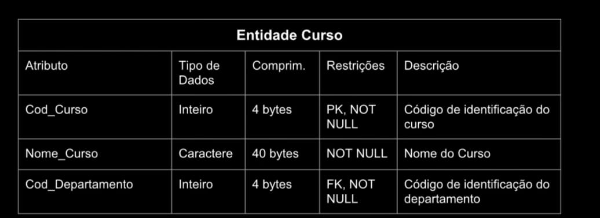

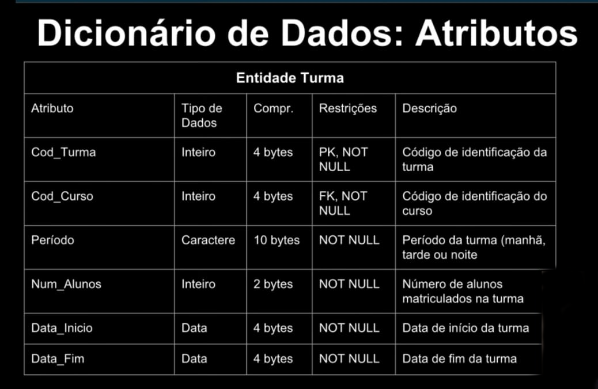

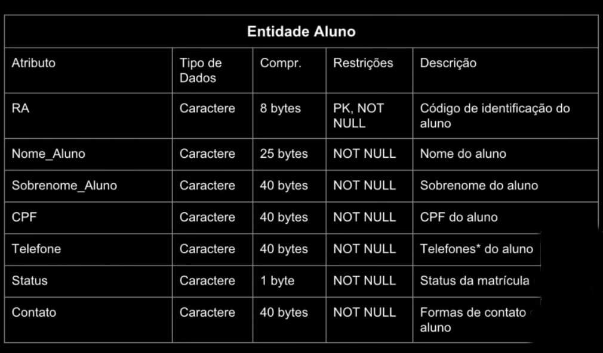

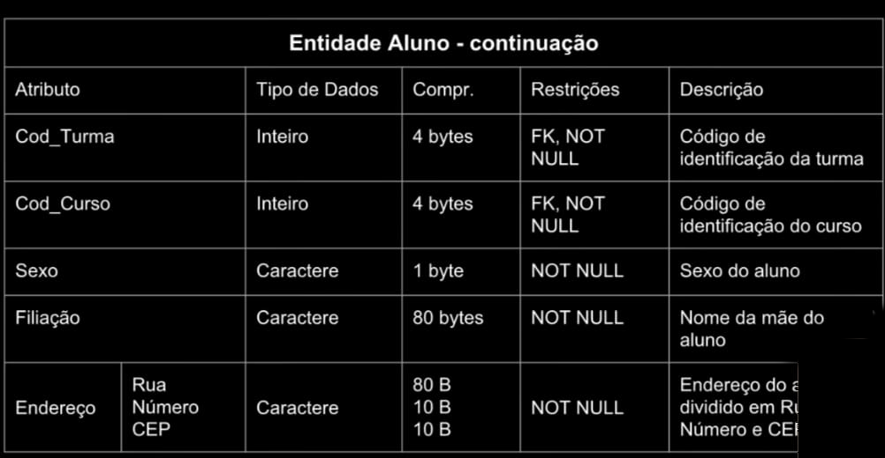

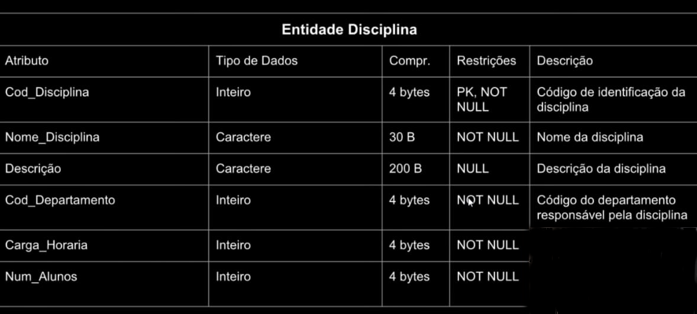

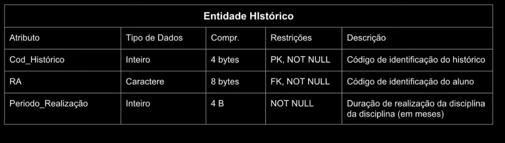

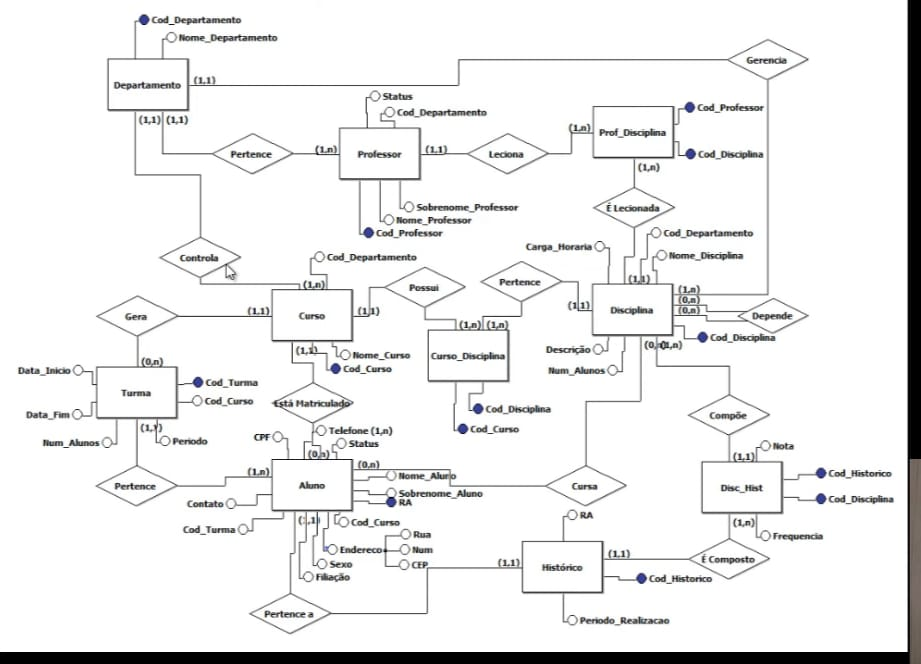

# **Projeto Prático : Deriva o Modelo Lógico**

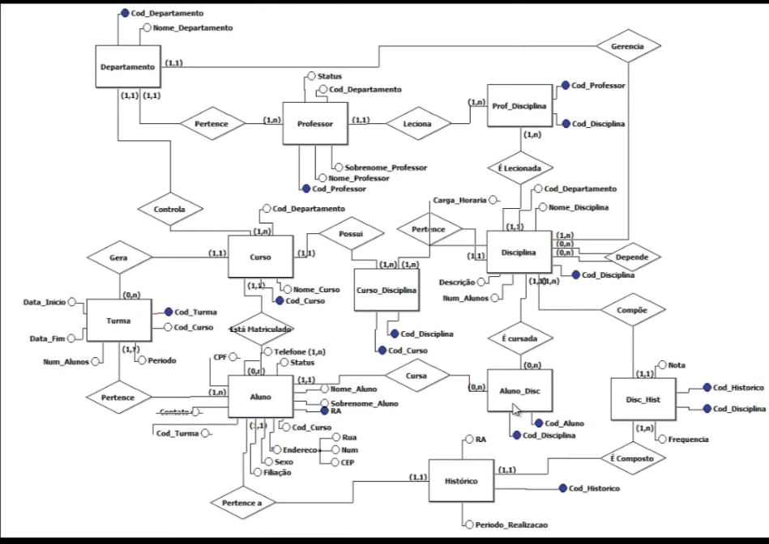

Aparece novo Relacionamente que deve ser adicionado ao Dicionário de Dados: Aluno/Disciplina.

# **Modelo Lógico**

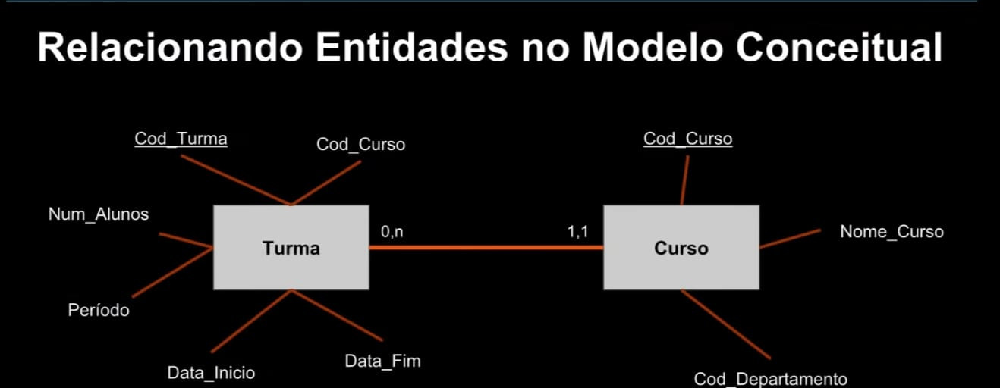

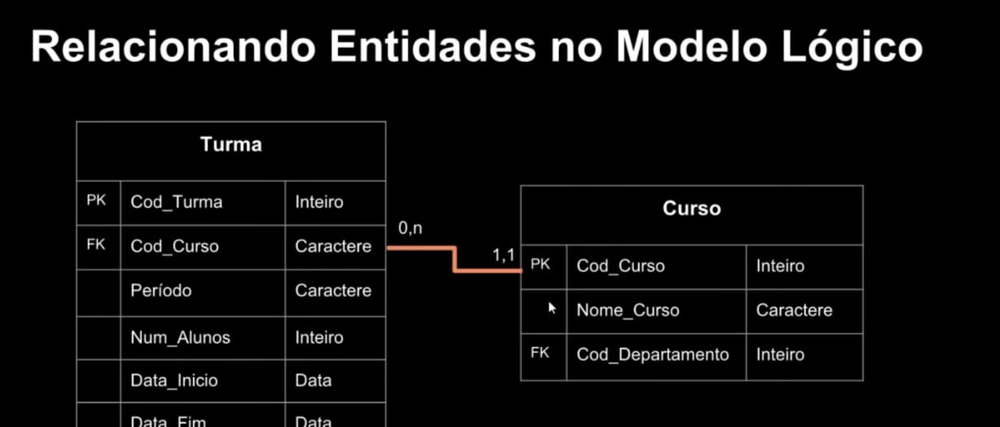

## **Utilizar o brModelo**

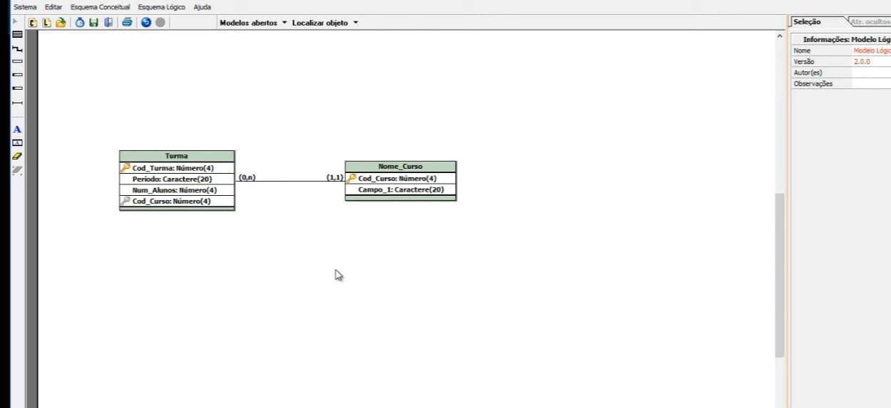

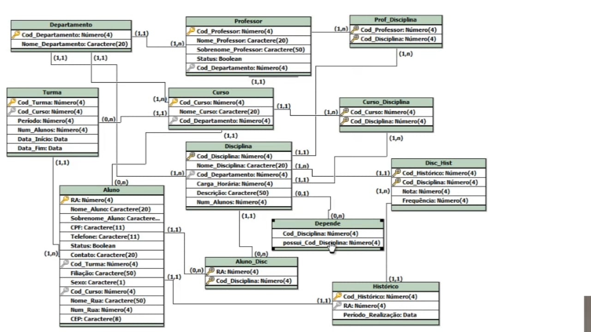

# **Primeira Forma NormaL**

Uma tabela está na 1ª forma normal quando:

 - Existe uma chave primária;
 - Somente possui valores atômicos;
 - Relação não possuis atributos multivalorados ou relaçoões aninhadas;
 - Relação não possui atributos compostos.

         
             Tabela Departamento

| Chave | Atributo | Tipo de Dado |
|-----------|--------------|------------------|
| PK        | Cod_Departamento | Número          |
|           | Nome_Departamento | Caractere       |
           

               Tabela Professor

| Chave | Atributo | Tipo de Dado |
|-----------|--------------|------------------|
| PK        | Cod_Professor | Número           |
|           | Nome_Professor | Caractere       |
|           | Sobrenome_Professor | Caractere    |
|           | Status       | Booleano         |
| FK        | Cod_Departamento | Número          

                Tabela Turma

| Chave | Atributo | Tipo de Dado |
|-----------|--------------|------------------|
| PK        | Cod_Turma    | Número           |
| FK        | Cod_Curso    | Número           |
|           | Período      | Caractere        |
|           | Num_Alunos   | Número           |
|           | Data_Inicio  | Data             |
|           | Data_Fim     | Data             |

                Tabela Curso

| Chave | Atributo | Tipo de Dado |
|-----------|--------------|------------------|
| PK        | Cod_Curso    | Número           |
| FK        | Cod_Departamento | Número          |
|           | Nome_Curso   | Caractere        |
            

              Tabela Aluno

| Chave | Atributo | Tipo de Dado |
|-----------|--------------|------------------|
| PK        | RA           | Número           |
|           | Nome_Aluno   | Caractere        |
|           | Sobrenome_Aluno | Caractere       |
|           | Nome_Rua     | Caractere        |
|           | Num_Rua      | Número           |
|           | CEP          | Caractere        |
|           | Status       | Booleano         |
|           | Filiação     | Caractere        |
|           | Sexo         | Caractere        |
|           | Contato      | Caractere        |
|           | CPF          | Caractere        |
|           | Telefone     | Caractere        |
| FK        | Cod_Curso    | Número           |
| FK        | Cod_Turma    | Número           |

            Tabela Curso_Disciplina

| Chave | Atributo | Tipo de Dado |
|-----------|--------------|------------------|
| PK, FK    | Cod_Turma    | Número           |
| PK, FK    | Cod_Curso    | Número           |

               Tabela Histórico

| Chave | Atributo | Tipo de Dado |
|-----------|--------------|------------------|
| PK        | Cód_Histórico | Número           |
| FK        | RA           | Número           |
|           | Período_Realização | Data          |

               Tabela Disciplina

| Chave | Atributo | Tipo de Dado |
|-----------|--------------|------------------|
| PK        | Cod_Disciplina | Número          |
| FK        | Cod_Departamento | Número          |
|           | Nome_Disciplina | Caractere       |
|           | Descrição    | Caractere        |
|           | Num_Alunos   | Número           |
|           | Carga_Horária | Número          |

              Tabela Aluno_Disc

| Chave | Atributo | Tipo de Dado |
|-----------|--------------|------------------|
| PK, FK    | RA           | Número           |
| PK, FK    | Cod_Disciplina | Número          |

             Tabela Disc_Hist
             
| Chave | Atributo | Tipo de Dado |
|-----------|--------------|------------------|
| PK, FK    | Cod_Histórico | Número           |
| FK        | Cod_Disciplina | Número          |
|           | Nota         | Número           |
|           | Frequência   | Número           |

# **DER - Modelo Lógico Completo ( em 1FN)**

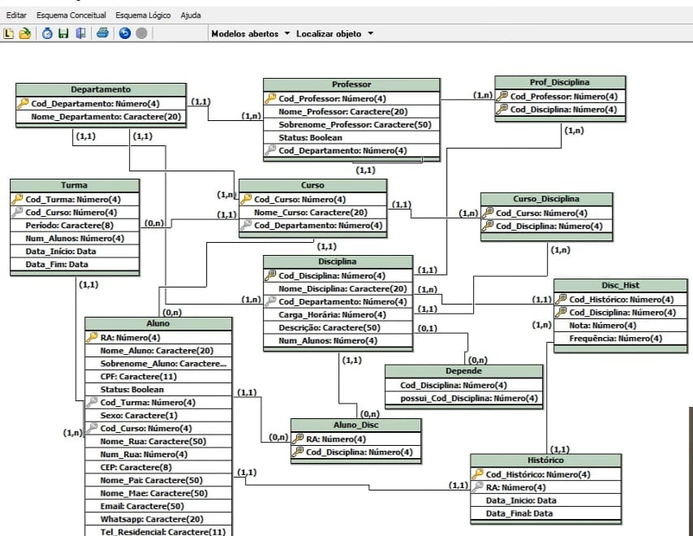

# **Normalizando as Tabelas segundo à 2ªFN**

Uma tabela está na 2ª forma normal quando:
 - Está na 1FN;
 - Todos os atributos não-chave são funcionalmente dependentes de todas as partes da chave primárias;
 - Não existem dependências parciais, e atributos não dependem de chaves candidatas;

Caso contrário, deve-se gerar uma nova tabela com os dados.
Um atributo-chave é um que é uma PK ou parte de uma PK composta.

Verificar tabela por tabela para saber se elas estão na 2ªFN.

              Tabela Departamento

| Chave | Atributo | Tipo de Dado |
|-----------|--------------|------------------|
| PK        | Cod_Departamento | Número          |
|           | Nome_Departamento | Caractere       |

*Nome_Departamento depende do Cod_DepartameNto ---> Ok, satisfaz a 2ªFN*.        

                 Tabela Professor

| Chave | Atributo | Tipo de Dado |
|-----------|--------------|------------------|
| PK        | Cod_Professor | Número           |
|           | Nome_Professor | Caractere       |
|           | Sobrenome_Professor | Caractere    |
|           | Status       | Booleano         |
| FK        | Cod_Departamento | Número          

*Nome_Professor, Sobrenome_Professor, Status dependem do Cod_Professor ---> Ok, satisfaz a 2ªFN*. O atributo Cod_Departamento por ser uma chave estrangeira, não se aplica esta análise. Só se aplica aos atributos não-chave.

                  Tabela Turma

| Chave | Atributo | Tipo de Dado |
|-----------|--------------|------------------|
| PK        | Cod_Turma    | Número           |
| FK        | Cod_Curso    | Número           |
|           | Período      | Caractere        |
|           | Num_Alunos   | Número           |
|           | Data_Inicio  | Data             |
|           | Data_Fim     | Data             |

*Período, Num_Alunos, Data_Inicio, Data_Fim, dependem Cod_Turma ---> Ok, satisfaz a 2ªFN*.

                  Tabela Curso

| Chave | Atributo | Tipo de Dado |
|-----------|--------------|------------------|
| PK        | Cod_Curso    | Número           |
| FK        | Cod_Departamento | Número          |
|           | Nome_Curso   | Caractere        |
            
*Nome_Curso depende do Cod_Curso ---> Ok, satisfaz a 2ªFN*.

                 Tabela Aluno

| Chave | Atributo | Tipo de Dado |
|-----------|--------------|------------------|
| PK        | RA           | Número           |
|           | Nome_Aluno   | Caractere        |
|           | Sobrenome_Aluno | Caractere       |
|           | Nome_Rua     | Caractere        |
|           | Num_Rua      | Número           |
|           | CEP          | Caractere        |
|           | Status       | Booleano         |
|           | Nome_Pai     | Caractere        |
|           | Nome_Mae     | Caractere        |
|           | Sexo         | Caractere        |
|           | Email        | Caractere        |
|           | Whatsap      | Caractere        |
|           | CPF          | Caractere        |
| FK        | Cod_Curso    | Número           |
| FK        | Cod_Turma    | Número           |
|           | Telefone_Res | Caractere        |
|           | Telefone_Cel | Caractere        |

Temos que encontrar campos que não sejam dependentes de RA, e não dependam de outrso campos.

Nome_Aluno, Sobrenome_Aluno, Status, Nome_Pai, Nome_Mae, Sexo, Email, Whatsap, CPF e Telefone_Cel dependem do RA;
Nome_Rua , Num_Rua, CEP e Telefone_Res não estão na 2ªFN;
É uma melhor prática tirar esses atributos que não estão em conformidade com a 2ªFN, não obrigatório, mas útil para melhor prática e perfomace do BD.

          Tabela Curso_Disciplina

| Chave | Atributo | Tipo de Dado |
|-----------|--------------|------------------|
| PK, FK    | Cod_Turma    | Número           |
| PK, FK    | Cod_Curso    | Número           |

OK, satisfaz a 2ªFN.

            Tabela Curso_Disciplina

| Chave | Atributo | Tipo de Dado |
|-----------|--------------|------------------|
| PK, FK    | Cod_Turma    | Número           |
| PK, FK    | Cod_Curso    | Número           |

É uma tabela associativa e se quer tem atributos não-chave, OK satisfaz a 2ªFN.

            Tabela Prof_Disciplina

| Chave | Atributo | Tipo de Dado |
|-----------|--------------|------------------|
| PK, FK    | Cod_Disciplina    | Número           |
| PK, FK    | Cod_Professor   | Número           |

É uma tabela associativa e se quer tem atributos não-chave, OK satisfaz a 2ªFN.

               Tabela Histórico

| Chave | Atributo | Tipo de Dado |
|-----------|--------------|------------------|
| PK        | Cód_Histórico | Número           |
| FK        | RA           | Número           |
|           | Data_Inicio | Data          |
|           | Data_Fim    | Data          |

Tanto Data_Inicio quanto Data_Fim são dependentes funcionais do Cod_Histórico. OK, está na 2ºFN.

                Tabela Disciplina

| Chave | Atributo | Tipo de Dado |
|-----------|--------------|------------------|
| PK,FK        | Cod_Disciplina | Número          |
| FK        | Cod_Departamento | Número          |
|           | Nome_Disciplina | Caractere       |
|           | Descrição    | Caractere        |
|           | Num_Alunos   | Número           |
|           | Carga_Horária | Número          |

Todos os atributos dependem do Cod_ Disciplina, OK, satisfaz a 2ªFN.

           Tabela Aluno_Disc

| Chave | Atributo | Tipo de Dado |
|-----------|--------------|------------------|
| PK, FK    | RA           | Número           |
| PK, FK    | Cod_Disciplina | Número          |

Tabela associativa, OK satisfaz a 2ª FN.

 Tabela Disc_Hist
             
| Chave | Atributo | Tipo de Dado |
|-----------|--------------|------------------|
| PK, FK    | Cod_Histórico | Número           |
| FK        | Cod_Disciplina | Número          |
|           | Nota         | Número           |
|           | Frequência   | Número           |

Os dois campos não-chave dependem integralmente da chave primária composta.OK, satisfaz a 2ªFN.

# **Tabela para armazenar Telefones:**

             Telefones_Aluno
             
| Chave | Atributo | Tipo de Dado |
|-----------|--------------|------------------|
| PK        | Cod_Telefones_Alunos | Número           |
| FK        | RA           | Número          |
| FK       | Cod_Tipo_Telefone        | Número           |
|           | Frequência   | Número           |
|           | Num_Telefone | Caractere        |

                Tipo_Telefonema
             
| Chave | Atributo | Tipo de Dado |
|-----------|--------------|------------------|
| PK  | Cod_Histórico| Número           |
| FK        | Cod_Tipo_Telefone | Número          |
|           | Tipo_Telefone        | Número           |

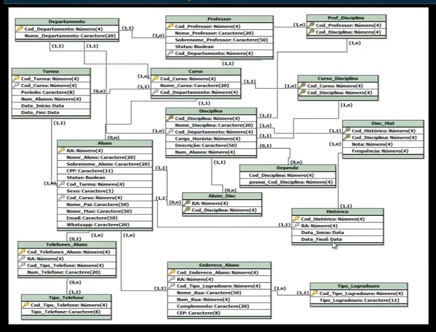

# **Normalizando as Tabelas: 3FN**

Uma tabela está na 3FN se:

 - Estiver na 2FN;
 - Não existirem dependências transitivas;
 - Uma tabela está na 3ªFN se ela estiver na 2FN e nenhuma coluna não-chave depender de outra coluna não-chave.
  
Dependência transitiva é uma dependência funcional entre dois ou mais atributos não-chave.
Caso contrário, deve-se gerar uma outra nova tabela.

# **Terceira Forma Normal - Como Resolver**

 - Para cada atributo ( ou grupo ) não-chave que for um determinante na relação, cria-se uma nova tabela;
 - Esse atributo será a PK na nova relação;
 - Move-se então todos os atributos que são dependentes funcionalmente do atributo chave para a nova tabela;
 - O atributo (PK na nova relação) fica também na tabela original, e servirá como uma chave estrangeira para associar as duas relações.

Próximo passo a seguir é verificar tabela por tabela se está na 3FN ou não.

Tabrela Departamento, Tabela Professor, Tabela Turma, Tabela Curso, Tabela Aluno, Tabela Curso-Disciplina, Tabela Prof_Disciplina, Tabela Histórico, Tabela Disciplina, Tabela Aluno_Disc, Tabela Disc_Hist, Tabela Telefones_Aluno, Tabela Tipo_Telefone, Tabela Endereco_Aluno ( Para colocarmos Cidade, Bairro e Estado; teríamos que criar novas tabelas ), Tabela Tipo_Logradouro. Estão portanto na 3ªFN.

Estas tabelas estão prontas para implementação no Banco de Dados.

# **Projeto Prático: Dicionário de Dados e Ajustes Finais**

                  Dicionário de Dados: Entidades 

| Entidade | Relacionamento | Nome do Relacionamento | Descrição |
|---------|-----------|----------|-------------------------------------------------|
|              | Professor  | Pertence  |                           |
| Departamento | Curso    | Controla   | Tabela para cadastro dos Departamentos da faculdade |
|              | Disciplina | Gerencia   |                                           |
|              |            |                                                          |
|              |            |            |                                                   |
|              | Departamento | Pertence  |                                                  |
| Professor   | Prof_Disciplina  | Leciona | Tabela para cadastro dos professores da faculdade |
|             |                  |         |                                                   |
|             |              |            |                                                    |
|          |       |          |                                                                |
|          | Curso | Gera     |                                                                |
| Turma    | Aluno | Pertence | Tabela para registro das turmas em andamento e encerradas |
|          |       |          |                                                           |
|          |       |          |                                                           |
|          | Departamento     | Controla         |                                        |
| Curso    | Turma            | Gera             |Tabela para cadastro dos cursos oferecidos |
|          | Aluno            | Está matriculado |pela faculdade                                 
|          | Curso_Disciplina | Possui           |                                           |
|          |                  |                  |                                             |  
|          | Curso            | Está matriculado |                                                  |
|          | Turma            | Pertence         | Tabela para cadastro de informações sobre os alunos da    |
| Aluno    | Aluno_disc       | Cursa            | faculdade |                                                          
|          | Histórico        | Pertence         |                                                           |
|          | Telenones_Alunos | Possui           |                                                           |
|          |                  |                  |                                                           |
|          | Aluno_Disc       | Cursa            |                                                           |
|          | Departamento     | Gerencia         |                                                           |
|          | Prof_Disciplina  | É lecionada      | Tabela para cadastro das disciplinas que compõem os cursos |
| Disciplina | Curso_Disciplina  | Pertence       | oferecidos pela faculdade                                 |
|          | Disciplina       | Depende          |                                                           |
|          | Disc_Hist        | Compõe           |                                                           |
|                                                                                                            |
|          | Aluno            | Pertence a       |                                                           |
| Histórico | Disc_Hist       | É composto       | Tabela para geração do histórico de notas e faltas dos    |
|           |                 |                  | alunos                                                    |
|                                                                                                            |
|           | Disciplina      | Compõe           |                                                           |
| Disc_Hist |                 |                  | Tabela associativa entre Disciplina e Histórico           |
|           | Histórico       | É composto       |  
|                                                                                                            |
|           | Curso           | Possui           |                                                           |
| Curso_Disciolina |          |                  | Tabela associativa entre Curso e Disciplina               |
|           | Disciplina      | Pertence         |                                                           |
|                                                                                                            |
|           | Professor       | Leciona          |                                                           |
| Prof_Disciplina |           |                  | Tabela associativa entre Professor e Disciplina           |
|           | Disciplina      | É lecionada      |                                                           |
|                                                                                                            |
|           | Aluno           | Possui           |                                                           |
| Endereco_Aluno |            |                  | Tabela para registros dos alunos                          |
|           | Tipo_Logradouro | É do tipo        |                                                           |
|                                                                                                            |
| Tipo_Logradouro | Endereco_Aluno | Compçõe     | Tabela de registros dos tipos de logradouros              |
|                                                                                                            |
|            | Aluno  | Cursa  |                                                                             |
| Aluno_Disc |        |        | Tabela associativa entre aluno e Disciplina                                 |
|            | Disciplina | É cursada |                                                                      |
|                                                                                                            |
|            | Aluno  | Possui  |                                                                            |
| Telefone_Aluno |        |             | Tabela para registro dos telefones dos alunos                      |
|                | Tipo_Telefone | Pertence |                                                                |
|                                                                                                             |
| Tipo_Telefone | Telefones_Aluno | Define | Descrição dos tipos de telefones aceitos.                       |
|---------------|-----------------|------------|-------------------------------------------------------------|

# **Atributos**

