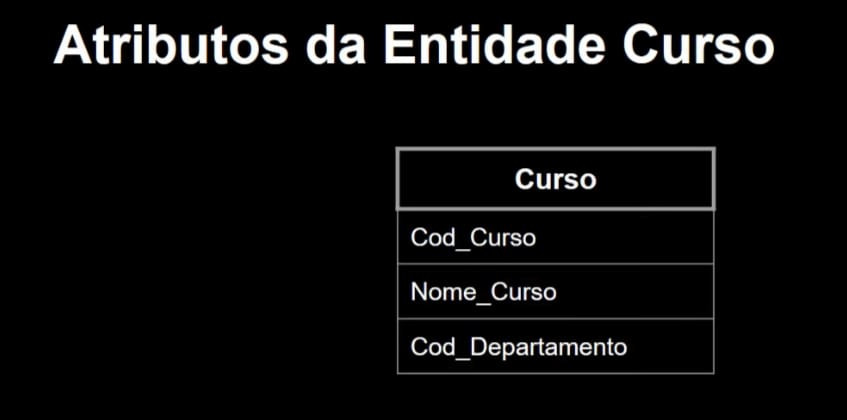
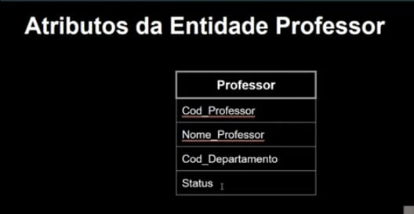
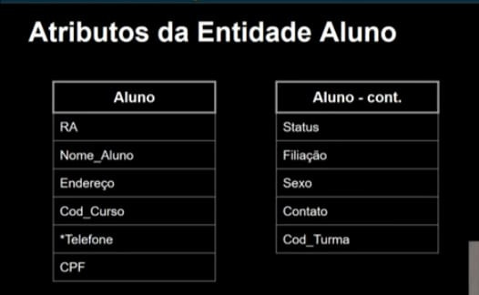
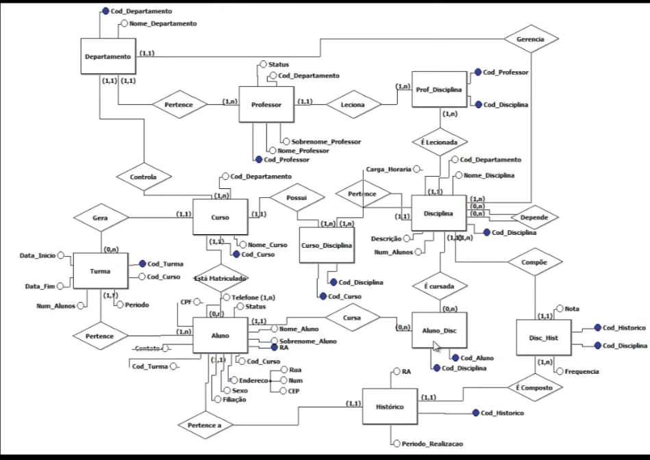

# **Apresentação**

Banco de Dados para gerenciamento de uma Faculdade.

Objetivos do Banco de Dados:

 - Realizar o controle centralizado de alunos, professores, cursos, disciplinas, histórico e turmas.

# **Fases do projeto**

Fases:

 - Levantamento dos Requisitos
 - Identificação de Entidades e Relacionamentos
 - Modelo E-R
 - Diagrama E-R
 - Dicionário de Dados
 - Normalização
 - Implementação (Usando o MySQL)
 - Testes Básicos (Consultas)

# **Regras de Negócio**

 - Um aluno só pode estar matriculado em um curso por vez
 - Alunos possuem um código de identificacão (RA)
 - Cursos são compostos por disciplinas
 - Cada disciplina terá no máximo 30 alunos por turma
 - As disciplinas podem ser obrigatórias ou optativas, dependendo do curso
 - As disciplinas pertncem a departamentos específicos
 - Cada disciplina possui um código de identificação
 - Alunos podem trancar matrícula, não estando então matriculados em nenhuma disciplina no semestre
 - Em cada semestre, cada aluno pode se matricular em no máximo 9 disciplinas
 - O aluno só pode ser reprovado no máximo 3 vezes na mesma disciplina
 - A faculdade terá no máximo 3.000 alunos matriculados simultaneamente, em 10 cursos distintos
 - Entram 300 alunos novos por ano
 - Existem 90 disciplinas no tital disponíveis
 - Um histórico Escolar traz todas as disciplinas cursadas por um aluno, incluindo nota fianl, frequência e período do curso realizado
 - Professores podem ser cadastrados mesmo sem lecionar disciplinas
 - Existem 40 professores trabalhando na escola
 - Cada professor irá lecionar no máximo 40 disciplinas diferentes
 - Cada profesor é vinculado a um departamento
 - Professores são identificados por um código de professor.

# **Identificando as Entidades, Atributos Relacionamentos**

Objetivos do Banco de Dados:

 - Realizar controle centralizado de alunos, professores, cursos, disciplinas, histórico escolar e turmas.

# **Identificando as Entidades**

 - Aluno
 - Professor
 - Disciplina
 - Curso
 - Departamento

# **Identificando os Relacionamentos**

 - Aluno está matriculado em Curso
 - Aluno Cursa Disciplina
 - Aluno Realizou Disciplina
 - Disciplina Pertence a Curso
 - Professor Ministra Disciolina
 - Professor Pertence a Departamento
 - Departamento é Responsável por Disciplina
 - Departamento Controle Curso
 - Disciplina Depende de Disciplina.

# **Identificando os Atributos - Aluno**

 - Número de Matrícula
 - Nome
 - Sobrenome
 - Endereço
    - Rua
    - Número
    - Bairro
    - CEP
    - Cidade
    - Estado
 - Código do Curso

# **Identificando os Atributos - Professor**

 - Código do Professor
 - Nome
 - Sobrenome
 - Código do Departamento

# **Identificando os Atributos - Disciplina**

 - Código da Disciplina
 - Nome da Disciplina
 - Descrição Curricular
 - Código do Departamento
 - Número de Alunos

# **Identificando os Atributos - Curso**

 - Código do Curso
 - Nome do Curso
 - Código do Departamento

# **Identificando os Atributos - Departamento**

 - Código do Departamento
 - Nome do Departamento

# **Ferramenta brModelo 3.0**

Funcionalidades
 - Modelagem de banco de dados: criar modelos de banco de dados relacionais
 - Geração de scripts: gerar scripts SQL para criar o banco de dados
 - Edição de modelos: editar e personalizar modelos de banco de dados

Uso
 - Desenvolvimento de banco de dados: criar e gerenciar bancos de dados
 - Análise de sistemas: analisar e modelar sistemas de informação

Vantagens
 - Facilidade de uso: interface intuitiva e fácil de usar
 - Produtividade: aumenta a produtividade no desenvolvimento de banco de dados
  
sis4.com/brmodelo/

# **DER Cardinalidades**

# **Entidade Associativa** 

Uma Entidade Associativa é implementada para resolver um relacionamento muitos-para-muitos (N:M).
Gera uma tabela associativa, que permite mapear duas ou mais tabelas fazendo referência às chaves primárias de cada tabela.
Contém chaves estrangeiras, cada uma em um relacionamento um-para-muitos da tabela de junção para as tabelas de dados individuais.
Sua chave primária, no geral, é composta a partir das colunas de chaves estrangeiras em si.
Uma tabela associativa também pode ser chamada de: Tabela de Referência Cruzada, Tabela de Intersecção, Tabela de Junção, Tabela de Mapeamento, Tabela de Transição, ou ainda outros nomes.

# **Relacionamentos N:M**

 - Curso Pertence Disciplina.
 - Disciplina Compõe Histórico.
 - Professor Ministra Disciplina.

Precisamos gerar Entidades Associativas para os relacionamentos Pertence, Compõe e Ministra.

[alt text](Assets_projeto_modelagem01/img_projeto_relac_associativa_curso_disciplina.png)

# **DER INTERMEDIÁRIO - Após criar as entidades asociativas**

# **Criar um dicionário de Dados**

# **Fases do Projeto**

Fases:

 - Levantamento dos Requisitos;
 - Identificação de Entidades e Relacionamentos;
 - Diagrama E-R: Cardinalidades;
 - Diagrama E-R: Eliminando N:M;
 - *Dicionário de Dados*;
 - Modelo Lógico;
 - Normalização;
 - Implementação;
 - Testes Básicos.

# **Dicionário de Dados: Entidades**

# **Dicionário de Dados: Atributos**

# **Projeto Prático : Deriva o Modelo Lógico**

Aparece novo Relacionamente que deve ser adicionado ao Dicionário de Dados: Aluno/Disciplina.

# **Modelo Lógico**

## **Utilizar o brModelo**

# **Primeira Forma NormaL**

Uma tabela está na 1ª forma normal quando:

 - Existe uma chave primária;
 - Somente possui valores atômicos;
 - Relação não possuis atributos multivalorados ou relaçoões aninhadas;
 - Relação não possui atributos compostos.

              Departamento

 - PK     Cod_Departamento     Número
 -        Nome_Departamento    Caractere
  
          Tabela Departamento

|            Departamento            |
|------------------------------------|
| PK | Cod_Departamento  | Número    |
|    | Nome_Departamento | Caractere |

           Tabela Professor

|              Professor               |
|--------------------------------------|
| PK | Cod_Professor       | Número    |
|    | Nome_Professor      | Caractere |
|    | Sobrenome_Professor | Caractere |
|    | Status              | Booleano  |
| FK | Cod_Departamento    | Número    |

            Tabela Turma

|              Turma                   |
|--------------------------------------|
| PK | Cod_Turma           | Número    |
| FK | Cod_Curso           | Número    |
|    | Período             | Caractere |
|    | Num_Alunos          | Número    |
|    | Data_Inicio         | Data      |
|    | Data_Fim            | Data      |

           Tabela Curso

|             Curso                    |
|--------------------------------------|
| PK | Cod_Curso           | Número    |
|    | Cod_Departamento    | Número    |
|    | Nome_Curso          | Caractere |

            Tabela Aluno
 
|              Aluno                   |
|--------------------------------------|
| PK | RA                  | Número    |
|    | Nome_Aluno          | Caractere |
|    | Sobrenome_Aluno     | Caractere |
|    | Nome_Rua            | Caractere |
|    | Num_Rua             | Número    |
|    | CEP                 | Caractere |
|    | Status              | Booleano  |
|    | Filiação            | Caractere |
|    | Sexo                | Caractere |
|    | Contato             | Caractere |
|    | CPF                 | Caractere |
| FK | Cod_Curso           | Número    |
| FK | Cod-Turma           | Número    |
|    | Telefone            | Caractere |

       Tabela Curso_Disciplina

|            Disciplina                |
|--------------------------------------|
| PK | Cod_Turma           | Número    |
| FK |                     |           |
| PK | Cod_Curso           | Número    |
| FK |                     |           |