# **Apresentação**

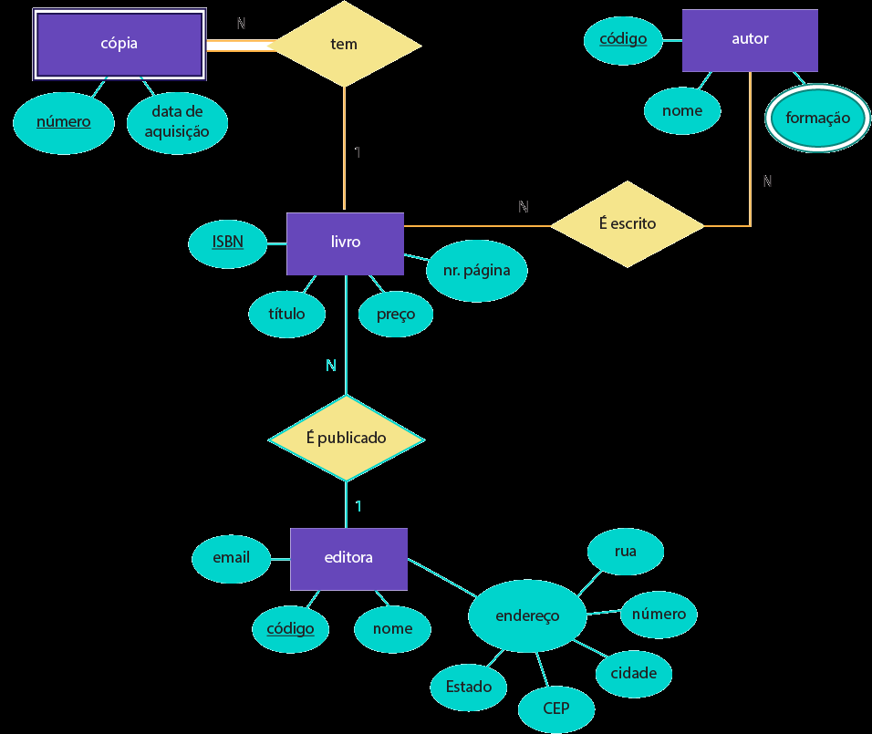

Banco de Dados para gerenciamento de uma Faculdade.

Objetivos do Banco de Dados:

 - Realizar o controle centralizado de alunos, professores, cursos, disciplinas, histórico e turmas.

# **Fases do projeto**

Fases:

 - Levantamento dos Requisitos
 - Identificação de Entidades e Relacionamentos
 - Modelo E-R
 - Diagrama E-R
 - Dicionário de Dados
 - Normalização
 - Implementação (Usando o MySQL)
 - Testes Básicos (Consultas)

# **Regras de Negócio**

 - Um aluno só pode estar matriculado em um curso por vez
 - Alunos possuem um código de identificacão (RA)
 - Cursos são compostos por disciplinas
 - Cada disciplina terá no máximo 30 alunos por turma
 - As disciplinas podem ser obrigatórias ou optativas, dependendo do curso
 - As disciplinas pertncem a departamentos específicos
 - Cada disciplina possui um código de identificação
 - Alunos podem trancar matrícula, não estando então matriculados em nenhuma disciplina no semestre
 - Em cada semestre, cada aluno pode se matricular em no máximo 9 disciplinas
 - O aluno só pode ser reprovado no máximo 3 vezes na mesma disciplina
 - A faculdade terá no máximo 3.000 alunos matriculados simultaneamente, em 10 cursos distintos
 - Entram 300 alunos novos por ano
 - Existem 90 disciplinas no tital disponíveis
 - Um histórico Escolar traz todas as disciplinas cursadas por um aluno, incluindo nota fianl, frequência e período do curso realizado
 - Professores podem ser cadastrados mesmo sem lecionar disciplinas
 - Existem 40 professores trabalhando na escola
 - Cada professor irá lecionar no máximo 40 disciplinas diferentes
 - Cada profesor é vinculado a um departamento
 - Professores são identificados por um código de professor.

# **Identificando as Entidades, Atributos Relacionamentos**

Objetivos do Banco de Dados:

 - Realizar controle centralizado de alunos, professores, cursos, disciplinas, histórico escolar e turmas.

# **Identificando as Entidades**

 - Aluno
 - Professor
 - Disciplina
 - Curso
 - Departamento

# **Identificando os Relacionamentos**

 - Aluno está matriculado em Curso
 - Aluno Cursa Disciplina
 - Aluno Realizou Disciplina
 - Disciplina Pertence a Curso
 - Professor Ministra Disciolina
 - Professor Pertence a Departamento
 - Departamento é Responsável por Disciplina
 - Departamento Controle Curso
 - Disciplina Depende de Disciplina.

# **Identificando os Atributos - Aluno**

 - Número de Matrícula
 - Nome
 - Sobrenome
 - Endereço
    - Rua
    - Número
    - Bairro
    - CEP
    - Cidade
    - Estado
 - Código do Curso

# **Identificando os Atributos - Professor**

 - Código do Professor
 - Nome
 - Sobrenome
 - Código do Departamento

# **Identificando os Atributos - Disciplina**

 - Código da Disciplina
 - Nome da Disciplina
 - Descrição Curricular
 - Código do Departamento
 - Número de Alunos

# **Identificando os Atributos - Curso**

 - Código do Curso
 - Nome do Curso
 - Código do Departamento

# **Identificando os Atributos - Departamento**

 - Código do Departamento
 - Nome do Departamento

# **Atributos da Entidade Curso**

| Curso | 
|-----------|
| Cod_Curso    | 
| Nome_Curso   | 
| Cod_Departamento |           


# **Ferramenta brModelo 3.0**

Funcionalidades
 - Modelagem de banco de dados: criar modelos de banco de dados relacionais
 - Geração de scripts: gerar scripts SQL para criar o banco de dados
 - Edição de modelos: editar e personalizar modelos de banco de dados

Uso
 - Desenvolvimento de banco de dados: criar e gerenciar bancos de dados
 - Análise de sistemas: analisar e modelar sistemas de informação

Vantagens
 - Facilidade de uso: interface intuitiva e fácil de usar
 - Produtividade: aumenta a produtividade no desenvolvimento de banco de dados
  
sis4.com/brmodelo/

# **Atributos da entidade Professor**

| Professor |
|-----------|
| Cod_Professor | 
| Nome_Professor | 
| Cod_Departamento   | 
| Status       | 
       

# **Atributos da entidade Aluno**

| Aluno    | 
|--------------|
| RA           | 
| Nome_Aluno   | 
| Endereço      | 
| Cod_Curso    | 
| *Telefone    | 
| CPF    | 
| Status          | 
| Filiação     | 
| Sexo  | 
| Contato  |
| Cod_Turma    | 


| Departamento |               
|-----------|               
| Cód_Departamento |           
| Nome_Departamento |   


| Disciplina |               
|-----------|               
| Cód_Disciplina |           
| Nome_Disciplina |                   
| Descrição |                   
| Cod_Departamento |              
| Num_Alunos |      
| Carga_Horária |            

# **Novas Entidades e Atributos**

| Histórico |               
|-----------|               
| Cód_Histórico |           
| Notas |                   
| Média |                   
| Frequência |              
| Período_Realização |      
| RA           |            
| Cod_Disciplina | 


| Turma |
|------------|
| Cod_Turma |
| Período  |
| Cod_Curso |
| Nom_Alunos |
| Data_Início |
| Data_Fim |


# **Atributos da entidade Curso**

| Curso | 
|--------------|
| Cod_Curso    |  
| Nome_Curso   | 
| Cod_Departamento |

# **DER Cardinalidades**

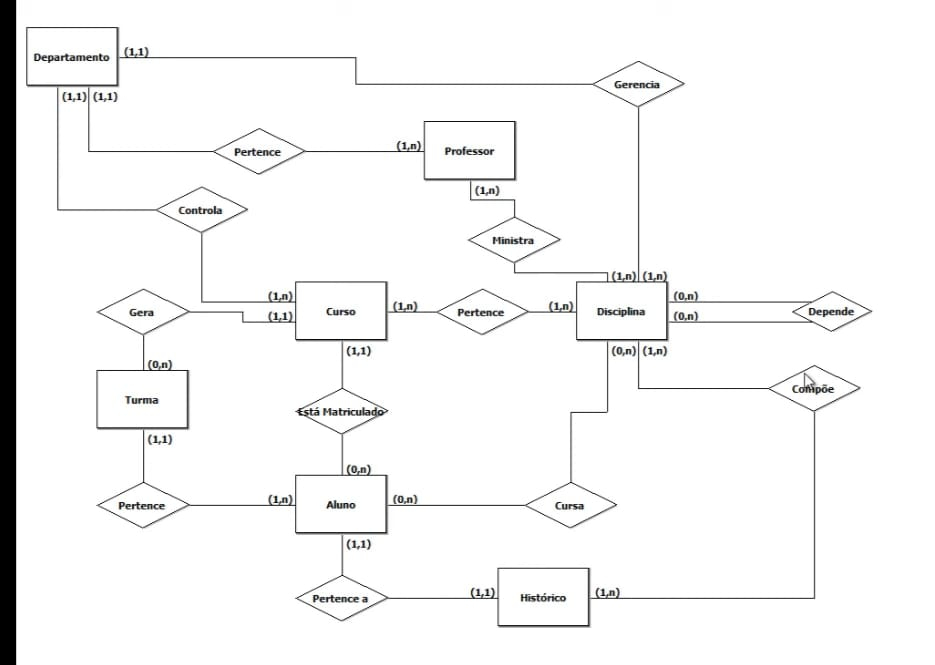

# **Entidade Associativa** 

Uma Entidade Associativa é implementada para resolver um relacionamento muitos-para-muitos (N:M).
Gera uma tabela associativa, que permite mapear duas ou mais tabelas fazendo referência às chaves primárias de cada tabela.
Contém chaves estrangeiras, cada uma em um relacionamento um-para-muitos da tabela de junção para as tabelas de dados individuais.
Sua chave primária, no geral, é composta a partir das colunas de chaves estrangeiras em si.
Uma tabela associativa também pode ser chamada de: Tabela de Referência Cruzada, Tabela de Intersecção, Tabela de Junção, Tabela de Mapeamento, Tabela de Transição, ou ainda outros nomes.

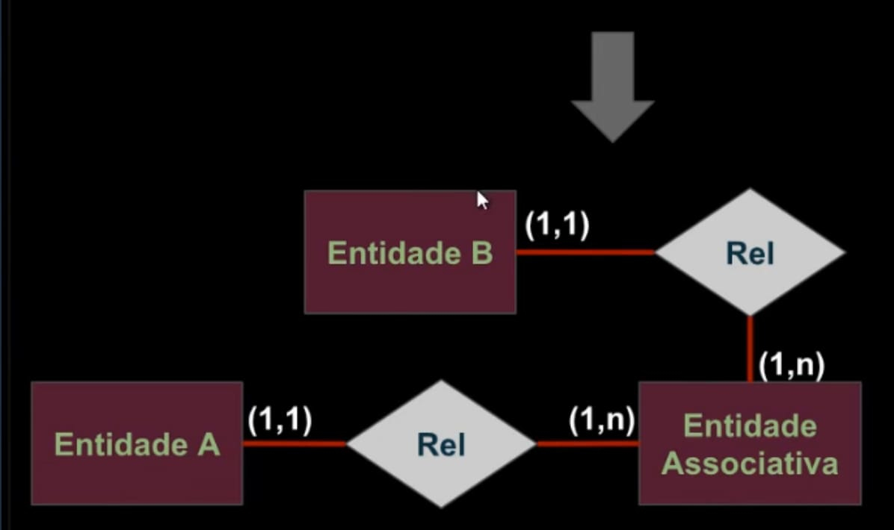

# **Relacionamentos N:M**

 - Curso Pertence Disciplina.
 - Disciplina Compõe Histórico.
 - Professor Ministra Disciplina.

Precisamos gerar Entidades Associativas para os relacionamentos Pertence, Compõe e Ministra.

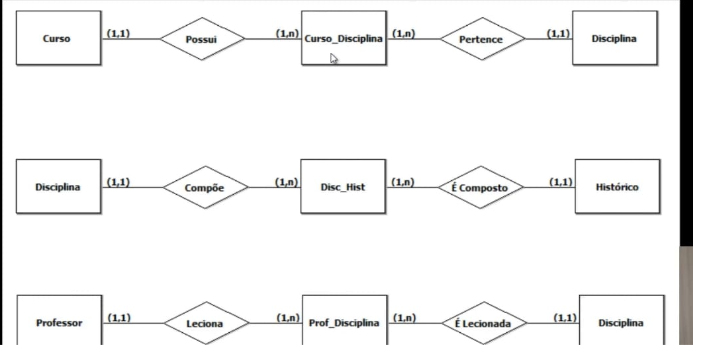

# **DER INTERMEDIÁRIO - Após criar as entidades asociativas**

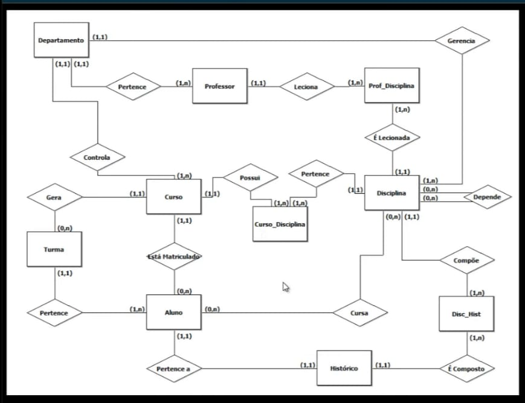

# **Criar um dicionário de Dados**

# **Fases do Projeto**

Fases:

 - Levantamento dos Requisitos;
 - Identificação de Entidades e Relacionamentos;
 - Diagrama E-R: Cardinalidades;
 - Diagrama E-R: Eliminando N:M;
 - *Dicionário de Dados*;
 - Modelo Lógico;
 - Normalização;
 - Implementação;
 - Testes Básicos.

# **Dicionário de Dados: Entidades**


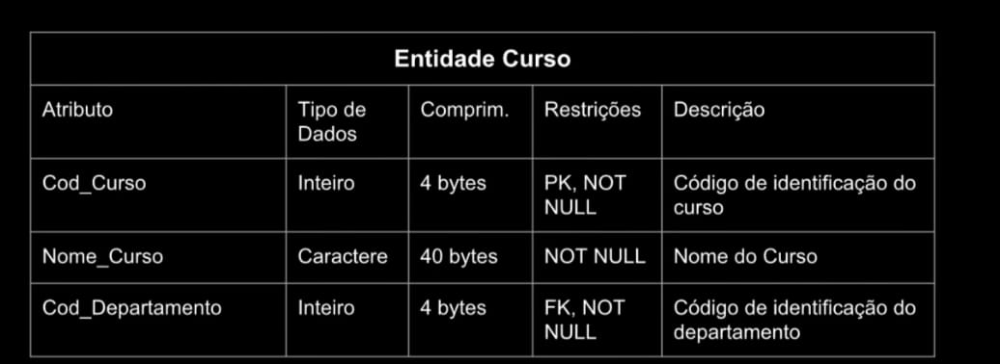


# **Dicionário de Dados: Atributos**

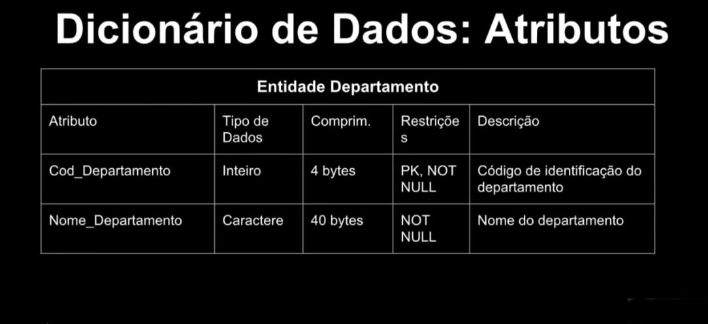

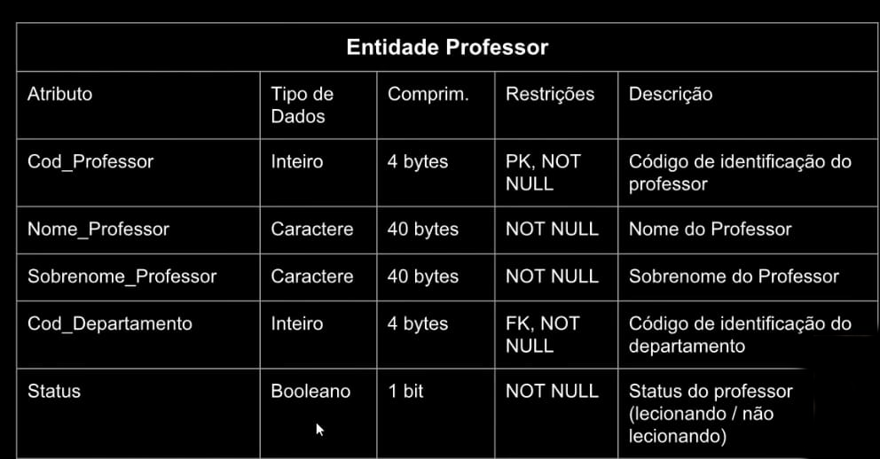


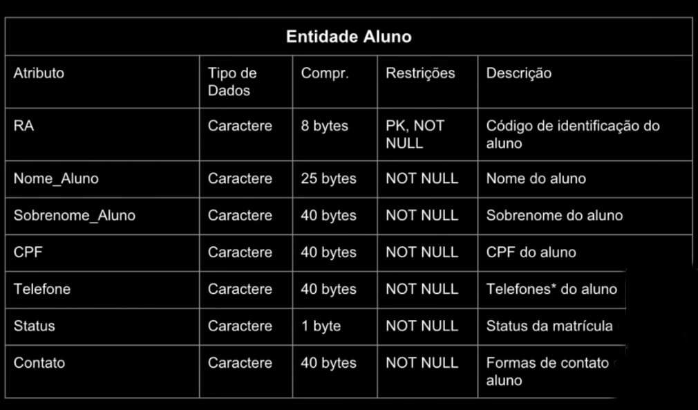

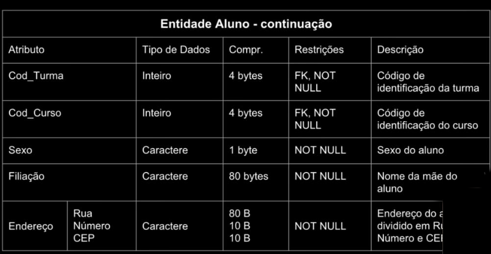

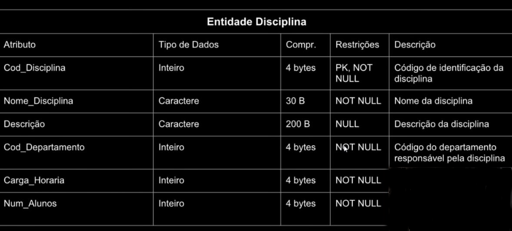

                                Entidade Histórico                                     
| Atributo          | Tipo de Dados    | Cumprim. | Restrições        | Descrição                        |  
|-------------------|------------------|----------|-------------------|----------------------------------|
| Cod_Histórico     | Inteiro       | 4 bytes  | PK, NOT NULL | Código de identificação do histórico     |
| RA                | Caractere     | 8 bytes  | FK, NOT NULL | Código de identificação do aluno         |
| Período_Realizacao | Inteiro     | 4 bytes  | NOT NULL     | Duração da ralização da disciplina em meses |


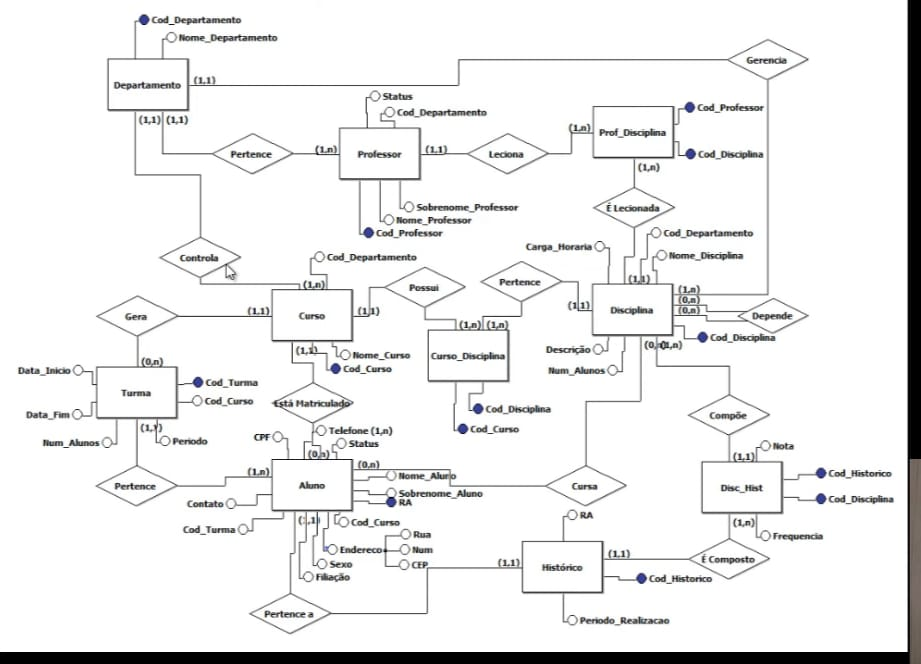

# **Projeto Prático : Deriva o Modelo Lógico**


Aparece novo Relacionamente que deve ser adicionado ao Dicionário de Dados: Aluno/Disciplina.

# **Modelo Lógico**

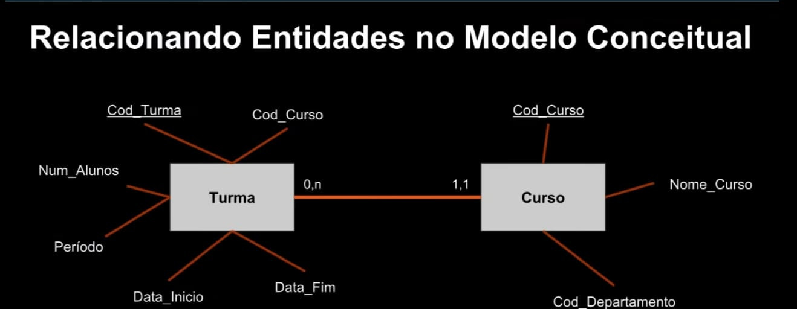

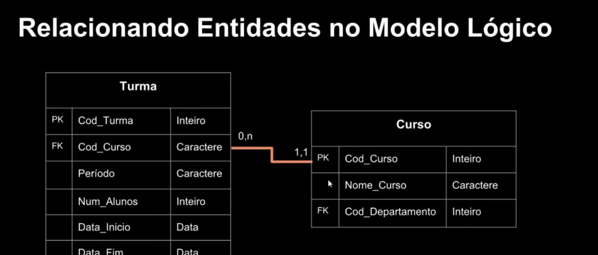

## **Utilizar o brModelo**


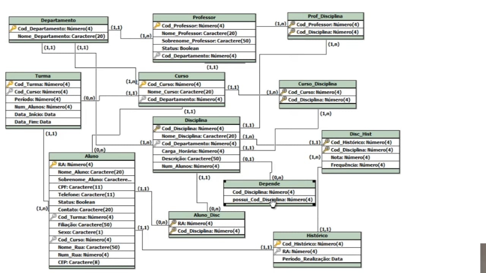

# **Primeira Forma NormaL**

Uma tabela está na 1ª forma normal quando:

 - Existe uma chave primária;
 - Somente possui valores atômicos;
 - Relação não possuis atributos multivalorados ou relaçoões aninhadas;
 - Relação não possui atributos compostos.

         
             Tabela Departamento

| Chave | Atributo | Tipo de Dado |
|-----------|--------------|------------------|
| PK        | Cod_Departamento | Número          |
|           | Nome_Departamento | Caractere       |
           

               Tabela Professor

| Chave | Atributo | Tipo de Dado |
|-----------|--------------|------------------|
| PK        | Cod_Professor | Número           |
|           | Nome_Professor | Caractere       |
|           | Sobrenome_Professor | Caractere    |
|           | Status       | Booleano         |
| FK        | Cod_Departamento | Número          


                Tabela Turma

| Chave | Atributo | Tipo de Dado |
|-----------|--------------|------------------|
| PK        | Cod_Turma    | Número           |
| FK        | Cod_Curso    | Número           |
|           | Período      | Caractere        |
|           | Num_Alunos   | Número           |
|           | Data_Inicio  | Data             |
|           | Data_Fim     | Data             |


                Tabela Curso

| Chave | Atributo | Tipo de Dado |
|-----------|--------------|------------------|
| PK        | Cod_Curso    | Número           |
| FK        | Cod_Departamento | Número          |
|           | Nome_Curso   | Caractere        |
            

              Tabela Aluno

| Chave | Atributo | Tipo de Dado |
|-----------|--------------|------------------|
| PK        | RA           | Número           |
|           | Nome_Aluno   | Caractere        |
|           | Sobrenome_Aluno | Caractere       |
|           | Nome_Rua     | Caractere        |
|           | Num_Rua      | Número           |
|           | CEP          | Caractere        |
|           | Status       | Booleano         |
|           | Filiação     | Caractere        |
|           | Sexo         | Caractere        |
|           | Contato      | Caractere        |
|           | CPF          | Caractere        |
|           | Telefone     | Caractere        |
| FK        | Cod_Curso    | Número           |
| FK        | Cod_Turma    | Número           |


            Tabela Curso_Disciplina

| Chave | Atributo | Tipo de Dado |
|-----------|--------------|------------------|
| PK, FK    | Cod_Turma    | Número           |
| PK, FK    | Cod_Curso    | Número           |


               Tabela Histórico

| Chave | Atributo | Tipo de Dado |
|-----------|--------------|------------------|
| PK        | Cód_Histórico | Número           |
| FK        | RA           | Número           |
|           | Período_Realização | Data          |


               Tabela Disciplina

| Chave | Atributo | Tipo de Dado |
|-----------|--------------|------------------|
| PK        | Cod_Disciplina | Número          |
| FK        | Cod_Departamento | Número          |
|           | Nome_Disciplina | Caractere       |
|           | Descrição    | Caractere        |
|           | Num_Alunos   | Número           |
|           | Carga_Horária | Número          |


              Tabela Aluno_Disc

| Chave | Atributo | Tipo de Dado |
|-----------|--------------|------------------|
| PK, FK    | RA           | Número           |
| PK, FK    | Cod_Disciplina | Número          |


             Tabela Disc_Hist
             
| Chave | Atributo | Tipo de Dado |
|-----------|--------------|------------------|
| PK, FK    | Cod_Histórico | Número           |
| FK        | Cod_Disciplina | Número          |
|           | Nota         | Número           |
|           | Frequência   | Número           |


# **DER - Modelo Lógico Completo ( em 1FN)**

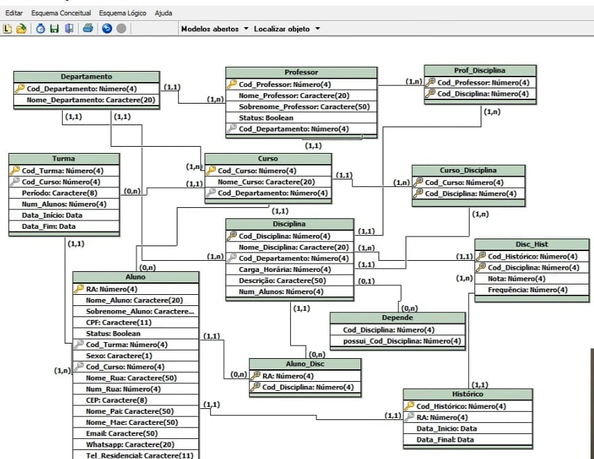

# **Normalizando as Tabelas segundo à 2ªFN**

Uma tabela está na 2ª forma normal quando:
 - Está na 1FN;
 - Todos os atributos não-chave são funcionalmente dependentes de todas as partes da chave primárias;
 - Não existem dependências parciais, e atributos não dependem de chaves candidatas;

Caso contrário, deve-se gerar uma nova tabela com os dados.
Um atributo-chave é um que é uma PK ou parte de uma PK composta.

Verificar tabela por tabela para saber se elas estão na 2ªFN.

              Tabela Departamento

| Chave | Atributo | Tipo de Dado |
|-----------|--------------|------------------|
| PK        | Cod_Departamento | Número          |
|           | Nome_Departamento | Caractere       |

*Nome_Departamento depende do Cod_DepartameNto ---> Ok, satisfaz a 2ªFN*.        


                 Tabela Professor

| Chave | Atributo | Tipo de Dado |
|-----------|--------------|------------------|
| PK        | Cod_Professor | Número           |
|           | Nome_Professor | Caractere       |
|           | Sobrenome_Professor | Caractere    |
|           | Status       | Booleano         |
| FK        | Cod_Departamento | Número          

*Nome_Professor, Sobrenome_Professor, Status dependem do Cod_Professor ---> Ok, satisfaz a 2ªFN*. O atributo Cod_Departamento por ser uma chave estrangeira, não se aplica esta análise. Só se aplica aos atributos não-chave.


                  Tabela Turma

| Chave | Atributo | Tipo de Dado |
|-----------|--------------|------------------|
| PK        | Cod_Turma    | Número           |
| FK        | Cod_Curso    | Número           |
|           | Período      | Caractere        |
|           | Num_Alunos   | Número           |
|           | Data_Inicio  | Data             |
|           | Data_Fim     | Data             |

*Período, Num_Alunos, Data_Inicio, Data_Fim, dependem Cod_Turma ---> Ok, satisfaz a 2ªFN*.


                  Tabela Curso

| Chave | Atributo | Tipo de Dado |
|-----------|--------------|------------------|
| PK        | Cod_Curso    | Número           |
| FK        | Cod_Departamento | Número          |
|           | Nome_Curso   | Caractere        |
            
*Nome_Curso depende do Cod_Curso ---> Ok, satisfaz a 2ªFN*.


                 Tabela Aluno

| Chave | Atributo | Tipo de Dado |
|-----------|--------------|------------------|
| PK        | RA           | Número           |
|           | Nome_Aluno   | Caractere        |
|           | Sobrenome_Aluno | Caractere       |
|           | Nome_Rua     | Caractere        |
|           | Num_Rua      | Número           |
|           | CEP          | Caractere        |
|           | Status       | Booleano         |
|           | Nome_Pai     | Caractere        |
|           | Nome_Mae     | Caractere        |
|           | Sexo         | Caractere        |
|           | Email        | Caractere        |
|           | Whatsap      | Caractere        |
|           | CPF          | Caractere        |
| FK        | Cod_Curso    | Número           |
| FK        | Cod_Turma    | Número           |
|           | Telefone_Res | Caractere        |
|           | Telefone_Cel | Caractere        |


Temos que encontrar campos que não sejam dependentes de RA, e não dependam de outrso campos.

Nome_Aluno, Sobrenome_Aluno, Status, Nome_Pai, Nome_Mae, Sexo, Email, Whatsap, CPF e Telefone_Cel dependem do RA;
Nome_Rua , Num_Rua, CEP e Telefone_Res não estão na 2ªFN;
É uma melhor prática tirar esses atributos que não estão em conformidade com a 2ªFN, não obrigatório, mas útil para melhor prática e perfomace do BD.


          Tabela Curso_Disciplina

| Chave | Atributo | Tipo de Dado |
|-----------|--------------|------------------|
| PK, FK    | Cod_Turma    | Número           |
| PK, FK    | Cod_Curso    | Número           |

OK, satisfaz a 2ªFN.


            Tabela Curso_Disciplina

| Chave | Atributo | Tipo de Dado |
|-----------|--------------|------------------|
| PK, FK    | Cod_Turma    | Número           |
| PK, FK    | Cod_Curso    | Número           |

É uma tabela associativa e se quer tem atributos não-chave, OK satisfaz a 2ªFN.


            Tabela Prof_Disciplina

| Chave | Atributo | Tipo de Dado |
|-----------|--------------|------------------|
| PK, FK    | Cod_Disciplina    | Número           |
| PK, FK    | Cod_Professor   | Número           |

É uma tabela associativa e se quer tem atributos não-chave, OK satisfaz a 2ªFN.

               Tabela Histórico

| Chave | Atributo | Tipo de Dado |
|-----------|--------------|------------------|
| PK        | Cód_Histórico | Número           |
| FK        | RA           | Número           |
|           | Data_Inicio | Data          |
|           | Data_Fim    | Data          |

Tanto Data_Inicio quanto Data_Fim são dependentes funcionais do Cod_Histórico. OK, está na 2ºFN.

                Tabela Disciplina

| Chave | Atributo | Tipo de Dado |
|-----------|--------------|------------------|
| PK,FK        | Cod_Disciplina | Número          |
| FK        | Cod_Departamento | Número          |
|           | Nome_Disciplina | Caractere       |
|           | Descrição    | Caractere        |
|           | Num_Alunos   | Número           |
|           | Carga_Horária | Número          |

Todos os atributos dependem do Cod_ Disciplina, OK, satisfaz a 2ªFN.

           Tabela Aluno_Disc

| Chave | Atributo | Tipo de Dado |
|-----------|--------------|------------------|
| PK, FK    | RA           | Número           |
| PK, FK    | Cod_Disciplina | Número          |

Tabela associativa, OK satisfaz a 2ª FN.

 Tabela Disc_Hist
             
| Chave | Atributo | Tipo de Dado |
|-----------|--------------|------------------|
| PK, FK    | Cod_Histórico | Número           |
| FK        | Cod_Disciplina | Número          |
|           | Nota         | Número           |
|           | Frequência   | Número           |

Os dois campos não-chave dependem integralmente da chave primária composta.OK, satisfaz a 2ªFN.

# **Tabela para armazenar Telefones:**

             Telefones_Aluno
             
| Chave | Atributo | Tipo de Dado |
|-----------|--------------|------------------|
| PK        | Cod_Telefones_Alunos | Número           |
| FK        | RA           | Número          |
| FK       | Cod_Tipo_Telefone        | Número           |
|           | Frequência   | Número           |
|           | Num_Telefone | Caractere        |

                Tipo_Telefonema
             
| Chave | Atributo | Tipo de Dado |
|-----------|--------------|------------------|
| PK  | Cod_Histórico| Número           |
| FK        | Cod_Tipo_Telefone | Número          |
|           | Tipo_Telefone        | Número           |

# **Normalizando as Tabelas: 3FN**

Uma tabela está na 3FN se:

 - Estiver na 2FN;
 - Não existirem dependências transitivas;
 - Uma tabela está na 3ªFN se ela estiver na 2FN e nenhuma coluna não-chave depender de outra coluna não-chave.
  
Dependência transitiva é uma dependência funcional entre dois ou mais atributos não-chave.
Caso contrário, deve-se gerar uma outra nova tabela.

# **Terceira Forma Normal - Como Resolver**

 - Para cada atributo ( ou grupo ) não-chave que for um determinante na relação, cria-se uma nova tabela;
 - Esse atributo será a PK na nova relação;
 - Move-se então todos os atributos que são dependentes funcionalmente do atributo chave para a nova tabela;
 - O atributo (PK na nova relação) fica também na tabela original, e servirá como uma chave estrangeira para associar as duas relações.

Próximo passo a seguir é verificar tabela por tabela se está na 3FN ou não.

Tabrela Departamento, Tabela Professor, Tabela Turma, Tabela Curso, Tabela Aluno, Tabela Curso-Disciplina, Tabela Prof_Disciplina, Tabela Histórico, Tabela Disciplina, Tabela Aluno_Disc, Tabela Disc_Hist, Tabela Telefones_Aluno, Tabela Tipo_Telefone, Tabela Endereco_Aluno ( Para colocarmos Cidade, Bairro e Estado; teríamos que criar novas tabelas ), Tabela Tipo_Logradouro. Estão portanto na 3ªFN.

Estas tabelas estão prontas para implementação no Banco de Dados.

# **Projeto Prático: Dicionário de Dados e Ajustes Finais**

                  Dicionário de Dados: Entidades 

| Entidade | Relacionamento | Nome do Relacionamento | Descrição |
|---------|-----------|----------|---------------|
|                                                                                            |
|              | Professor  | Pertence  |                                                    |
| Departamento | Curso    | Controla   | Tabela para cadastro dos Departamentos da faculdade |
|              | Disciplina | Gerencia   |                                           |
|              |            |             |                                            |
|                                                                                            |
|              | Departamento | Pertence  |                                                  |
| Professor   |               |            |Tabela para cadastro dos professores da faculdade |
|             | Prof_Disciplina | Leciona |                                                    |
|             |                 |         |                                                   |
|                                                                                             |
|             | Curso           | Gera     |                                                  |
| Turma       |                 |          | Tabela para registro das turmas em andamento e encerradas |
|             | Aluno           | Pertence |                                                 |
|            |                  |          |                                                |
|                                                                                         |
|          | Departamento     | Controla         |                                        |
|          | Turma            | Gera             |                                            |
| Curso    |                   |                 |Tabela para cadastro dos cursos oferecidos |
|          | Aluno            | Está matriculado |pela faculdade                           |                             
|          | Curso_Disciplina | Possui           |                                           |
|                                                                                                   |
|          |                  |                  |                                                  |
|          | Curso            | Está matriculado |                                                  |
|          | Turma            | Pertence         |                                                          |
| Aluno    | Aluno_disc       | Cursa            |Tabela para cadastro de informações sobre os alunos da    |            
|          | Histórico        | Pertence         |faculdade                                                  |
|          | Telenones_Alunos | Possui           |                                                           |
|                                                                                                            | 
|          |                  |                  |                                                           |       
|          | Aluno_Disc       | Cursa            |                                                           |
|          | Departamento     | Gerencia         |                                                           |
|          | Prof_Disciplina  | É lecionada      |                                                           |
| Disciplina |                |                  |Tabela para cadastro das disciplinas que compõem os curso |
|          | Curso_Disciplina | Perrtence        |oferecidos pela faculdade                                 |
|          | Disciplina       | Depende          |                                                           |
|          | Disc_Hist        | Compõe           |                                                           |
|                                                                                                            |   
|          |                  |                  |                                                           |       
|          | Aluno            | Pertence a       |                                                           |
| Histórico |                 |                  | Tabela para geração do histórico de notas e faltas dos    |
|            | Disc_Hist       | É composto       | alunos                                                   |
|           |                 |                  |                                                           |
|                                                                                                            |
|           |                 |                  |                                                           |
|           | Disciplina      | Compõe           |                                                           |
| Disc_Hist |                 |                  | Tabela associativa entre Disciplina e Histórico           |
|           | Histórico       | É composto       |                                                           |
|                                                                                                            |  
|           |                 |                  |                                                           |         
|           | Curso           | Possui           |                                                           |
| Curso_Disciolina |          |                  | Tabela associativa entre Curso e Disciplina               |
|           | Disciplina      | Pertence         |                                                           |
|                                                                                                            | 
|           |                 |                  |                                                           |         
|           | Professor       | Leciona          |                                                           |
| Prof_Disciplina |           |                  | Tabela associativa entre Professor e Disciplina           |
|           | Disciplina      | É lecionada      |                                                           |
|                                                                                                            |
|           |                 |                  |                                                           |
|           | Aluno           | Possui           |                                                           |
| Endereco_Aluno |            |                  | Tabela para registros dos alunos                          |
|           | Tipo_Logradouro | É do tipo        |                                                           |
|           |                 |                  |                                                           |
|                                                                                                            |          
| Tipo_Logradouro | Endereco_Aluno | Compçõe     | Tabela de registros dos tipos de logradouros              |
|                                                                                                            |          
|            | Aluno  | Cursa  |                                                                             |
| Aluno_Disc |        |        | Tabela associativa entre aluno e Disciplina                                 |
|            | Disciplina | É cursada |                                                                      |
|                                                                                                            |   
|            |            |           |                                                                      |      
|            | Aluno  | Possui  |                                                                            |
| Telefone_Aluno |        |             | Tabela para registro dos telefones dos alunos                      |
|                | Tipo_Telefone | Pertence |                                                                |
|                                                                                                             |
|               |                 |        |                                                                 |
| Tipo_Telefone | Telefones_Aluno | Define | Descrição dos tipos de telefones aceitos.                       |
|               |                 |        |                                                                 |


# **Dicionário de Dados Atributos**


                               Entidade Departamento                                           
| Atributo          | Tipo de Dados    | Cumprim. | Restrições        | Descrição                        |  
|-------------------|------------------|----------|-------------------|----------------------------------|
| Cod_Departamento  | Inteiro       | 2 bytes  | PK, NOT NULL | Código de identificação do departamento |
| Nome_Departamento | Caractere     | 20 bytes | NOT NULL     | Nome do Departaemnto                    |


                               Entidade Professor                                          
| Atributo          | Tipo de Dados    | Cumprim. | Restrições        | Descrição                        |  
|-------------------|------------------|----------|-------------------|----------------------------------|
| Cod_Professor     | Inteiro       | 2 bytes  | PK, NOT NULL | Código de identificação do professor     |
| Nome_Professor    | Caractere     | 20 bytes | NOT NULL     | Nome do Professor                        |
| Sobrenome_Professor | Caractere   | 50 bytes | NOT NULL     | Sobrenome do Professor                   |
| Cod_Departamento  | Inteiro       | 2 bytes  | FK, NOT NULL | Código de identificação do departamento  |
| Status            | Booleano      | 1bit     | NOT NULL     | Status do professsor não lecionando      |


                               Entidade Curso
| Atributo          | Tipo de Dados    | Cumprim. | Restrições        | Descrição                        |  
|-------------------|------------------|----------|-------------------|----------------------------------|
| Cod_Curso         | Inteiro       | 2 bytes  | PK, NOT NULL | Código de identificação do curso         |
| Nome_Curso        | Caractere     | 40 bytes | NOT NULL     | Nome do curso                            |
| Cod_Departamento  | Inteiro       | 2 bytes  | FK, NOT NULL | Código do departamento                   |


                               Entidade Turma                                       
| Atributo          | Tipo de Dados    | Cumprim. | Restrições        | Descrição                        |  
|-------------------|------------------|----------|-------------------|----------------------------------|
| Cod_Turma         | Inteiro       | 2 bytes  | PK, NOT NULL | Código de identificação da turma         |
| Cod_Curso         | Inteiro       | 2 bytes  | FK, NOT NULL | Código do curso                          |
| Período           | Caractere     | 5 bytes  | NOT NULL     | Período da turma manhã, tarde ou noite   |
| Num_Alunos        | Inteiro       | 2 bytes  | NOT NULL     | Números de alunos matriculados na turma  |
| Data_Inicio       | Data          | 4 bytes  | NOT NULL     | Data início da turma                     |
| Data_Fim          | Data          | 4 bytes  | NOT NULL     | Data de fim da turma                     |


                               Entidade Aluno                                      
| Atributo          | Tipo de Dados    | Cumprim. | Restrições        | Descrição                        |  
|-------------------|------------------|----------|-------------------|----------------------------------|
| RA                | Caractere     | 8 bytes  | PK, NOT NULL | Código de identificação do aluno         |
| Nome_Aluno        | Caractere     | 20 bytes | NOT NULL     | Nome do aluno                            |
| Sobrenome_Aluno   | Caractere     | 50 bytes | NOT NULL     | Sobrenome do aluno
| CPF               | Caractere     | 11 bytes | NOT NULL, UNIQUE | CPF do aluno                         |
| Status            | Caractere     | 1 bit    | NOT NULL     | Status da matrícula do aluno             |
| Email             | Caractere     | 60 bytes | NOT NULL     | E-mail do aluno                         |
| Whatsapp          | Caractere     | 11 bytes | NULL         | Whatsapp do aluno                       |
| Cod_Turma         | Inteiro       | 2 bytes  | FK, NOT NULL | Código de identificação da turma        |
| Cod_Curso         | Inteiro       | 2 bytes  | FK, NOT NULL | Código de identificação do curso        |
| Sexo              | Caractere     | 1 byte   | NOT NULL     | Sexo do aluno                           |
| Nome_Mãe          | Caractere     | 80 bytes | NOT NULL     | Nome da mãe do aluno                  |
| Nome_Pai          | Caractere     | 80 bytes | NOT NULL     | Nome do pai do aluno                    |


                               Entidade Disciplia                            
| Atributo          | Tipo de Dados    | Cumprim.  | Restrições        | Descrição                       |  
|-------------------|------------------|-----------|-------------------|----------------------------------|
| Cod_Disciplina    | Inteiro       | 2 bytes   | PK, NOT NULL | Código de identificação da disciplina    |
| Nome_Disciplina   | Caractere     | 30 bytes  | NOT NULL     | Nome da disciplina                       |
| Descrição         | Caractere     | 200 bytes | NULL         | Descrição da disciplina                  |
| Cod_Departamento  | Inteiro       | 2 bytes   | FK, NOT NULL | Código do dpartamento sada disciplina    |
| Carga_Horaria     | Inteiro       | 2 bytes   | NOT NULL     | Carga horária da disciplina              |
| Num_Alunos        | Inteiro       | 2 bytes   | NOT NULL     | Quantidade de alunos                     |


                                Entidade Histórico                                     
| Atributo          | Tipo de Dados    | Cumprim. | Restrições        | Descrição                        |  
|-------------------|------------------|----------|-------------------|----------------------------------|
| Cod_Histórico     | Inteiro       | 2 bytes  | PK, NOT NULL | Código de identificação do histórico     |
| RA                | Caractere     | 6 bytes  | FK, NOT NULL | Código de identificação do aluno         |
| Data_Inicio       | Data          | 4 bytes  | NOT NULL     | Data início do curso                     |
| Data_Final        | Data          | 4 bytes  | NULL         | Data em que o alun o finalizou o curso   |


                                Entidade Disc_Hist                                    
| Atributo          | Tipo de Dados    | Cumprim. | Restrições        | Descrição                        |  
|-------------------|------------------|----------|-------------------|----------------------------------|
| Cod_Histórico     | Inteiro       | 2 bytes  | PK,FK,NOT NULL | Código de identificação do histórico     |
| Cod_Disciplina    | Inteiro       | 2 bytes  | PK,FK,NOT NULL | Código de identificação da disciplina    |
| Nota              | Decimal       | 8 bytes  | NOT NULL       | Nota da disciplina                       |
| Frequência        | Inteiro       | 2 bytes  | NOT NULL       | Número de faltas na disciplina           |


                                Entidade Curso_Disciplina                                         
| Atributo          | Tipo de Dados    | Cumprim. | Restrições        | Descrição                        |  
|-------------------|------------------|----------|-------------------|----------------------------------|
| Cod_Curso         | Inteiro       | 2 bytes  | PK,FK, NOT NULL | Código de identificação do curso      |
| Cod_Disciplina    | Inteiro       | 2 bytes  | PK,FK, NOT NULL | Código de identificação da disciplina |


                          Entidade Prof_Disciplina                                         
| Atributo          | Tipo de Dados    | Cumprim. | Restrições        | Descrição                        |  
|-------------------|------------------|----------|-------------------|----------------------------------|
| Cod_Professor     | Inteiro       | 2 bytes  | PK,FK, NOT NULL | Código de identificação do professor  |
| Cod_Disciplina    | Inteiro       | 2 bytes  | PK,FK, NOT NULL | Código de identificação da disciplina |


                          Entidade Aluno_Disc                                        
| Atributo          | Tipo de Dados    | Cumprim. | Restrições        | Descrição                        |  
|-------------------|------------------|----------|-------------------|----------------------------------|
| RA                | Caractere     | 6 bytes  | PK,FK, NOT NULL | Código de identificação do aluno      |
| Cod_Disciplina    | Inteiro       | 2 bytes  | PK,FK, NOT NULL | Código de identificação da disciplina |


                               Entidade Endereco_Aluno                                      
| Atributo          | Tipo de Dados    | Cumprim. | Restrições        | Descrição                        |  
|-------------------|------------------|----------|-------------------|----------------------------------|
| Cod_Endereco      | Inteiro       | 1 byte   | PK, NOT NULL   | Código de identificação do aluno         |
| RA                | Caractere     | 6 bytes  | PK,FK, NOT NULL| Código de identificação da disciplina    |
| Cod_Tipo_Logradouro  | Inteiro    | 1 byte   | FK, NOT NULL   | Código do tipo de logradouro           |
| Nome_Rua          | Caractere     | 50 bytes | NOT NULL       | Nome da rua                            |
| Num_Rua           | Inteiro       | 2 bytes  | NOT NULL       | Número do imóvel                       |
| Complemento       | Caractere     | 20 bytes | NULL           | Complemento                            |
| CEP               | Caractere     | 8 bytes  | NOT ULL        | CEP da rua                             |


                              Entidade Tipo_Logradouro                                      
| Atributo            | Tipo de Dados    | Cumprim. | Restrições        | Descrição                         |  
|---------------------|------------------|----------|-------------------|------------------------------------|
| Cod_Tipo_Logradouro | Inteiro          | 1 byte   | PK, NOT NULL   | Código de identificação do tipo de logradouro |
| Tipo_Logradouro     | Caractere        | 10 bytes | NOT NULL       | Nome do tipo de logradouro            |


                               Entidade Telefones_Aluno                                      
| Atributo          | Tipo de Dados    | Cumprim. | Restrições        | Descrição                        |  
|--------------------|------------------|----------|-------------------|----------------------------------|
| Cod_Telefone_Aluno | Inteiro       | 1 byte   | PK, NOT NULL  | Código de identificação do telefone       |
| RA                | Caractere     | 6 bytes  | FK, NOT NULL | RA do aluno                               |
| Cod_Tipo_Logradouro  | Inteiro    | 1 byte   | FK, NOT NULL   | Código do tipo de telefone              |
| Telefone          | Caractere     | 11 bytes | NOT NULL       | Número do telefone                      |


                              Entidade Tipo_Telefone                                      
| Atributo            | Tipo de Dados    | Cumprim. | Restrições        | Descrição                         |  
|---------------------|------------------|----------|-------------------|------------------------------------|
| Cod_Tipo_Telefone   | Inteiro          | 1 byte   | PK, NOT NULL   | Código de identificação do tipo de telefone |
| Tipo_Telefone       | Caractere        | 12 bytes | NOT NULL       | Nome do tipo de telefone              |


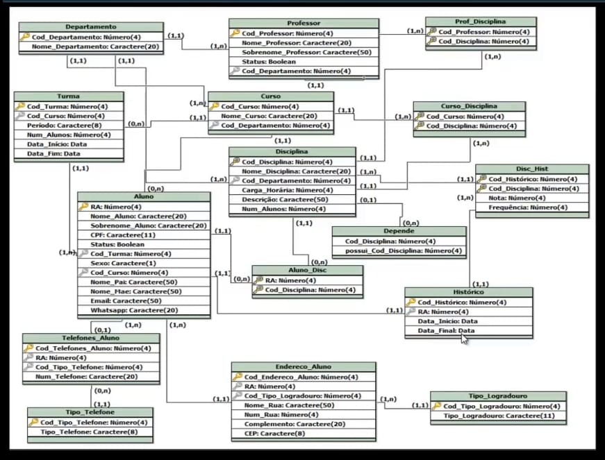

Exercício 2.1 - Considere a chave estrangeira professor.codigo_depto.
  
   Explique quais verificações devem ser realizadas pelo SGBD, quando:

    a. uma linha da tabela departamento for incluída,

    b. uma linha da tabela professor for excluída,

    c. a chave estrangeira professor.codigo_depto for alterada para um valor vazio.

departamento                                  
| codigo_depto        | nome_depto       | nivel_depto       | 
|---------------------|------------------|-------------------|
|        1            | Informática      | Pós-graduação     | 
|        2            | Administração    | Graduação         | 
|        3            | Medicina         | Graduação         |

Resp.: Nenhuma das operações listadas é capaz de levar o banco de dados a um estado inconsistente em relação à chave estrangeira considerada. Portanto, sua execução mão exige nenhuma verificação por parte do SGBD com referência à chave estrangeira do exemplo.


empregado                               
|   codigo_empregado  |       nome       |  cod_emp_chefe  |  
|---------------------|------------------|-----------------|
|         10          |     Pereira      |       NULL      | 
|         21          |     Tavares      |        10       | 
|         30          |     Satos        |        10       |
|         55          |     Almeida      |        21       | 

# Figura 2.7: Chave estrangeira que referencia a própria tabela.


Exercício 2.2 - Considere a chave estrangeira **empregado.cod_emp_chefe**(Figura 2.7). Liste quais são as operações de alteração do conteúdo desta tabela (inclusões, exclusões e alterações) nas quais o SGBD deve executar uma verificação para manter esta restrição de integridade. Em cada caso descreva a verificação que deve ser efetuada pelo SGBD.

Resp.: Para manter a integridade específica pela chave estrangeira **empregado.cod_emp_chefe**, o SGBD deve executar as seguintes verificações:

     - Quando da inclusão de uma linha na tabela;

       Neste caso, deve ser garantido que, caso seja informado um valor para cod_emp_chefe na linha incluída, este valor apareça na coluna codigo_emp.

     - Quando da alteração de cod_emp_chefe para um valor não vazio;

       Deve ser garantido que o novo valor do campo cod_emp_chefe apareça na coluna cod_emp.

     - Quando da exclusão de uma linha na tabela;

       Deve ser garantido que, na coluna cod_emp_chefe não apareça o valor do campo cod_emp da linha que está sendo excluída.

     - Quando da alteração do cod_emp;

       Deve ser garantido que, na coluna cod_emp-chefe, não apareça o antigo valor do campo codigo_emp.

 departamento                             
|   codigo_depto      |       nome       |  
|---------------------|------------------|
|        100          |     Vendas       |      
|        101          |   Financeiro     |        
|        102          |    Produção      |        
   


empregado                               
|   codigo_empregado  |       nome       |    cod_depto    | cod_emp_chefe  |  
|---------------------|------------------|-----------------|----------------|
|         10          |     Pereira      |      100        |      NULL      |
|         21          |     Tavares      |      101        |       10       |
|         30          |     Satos        |      100        |       10       |
|         55          |     Almeida      |      102        |       21       |

# Tabela 2.9: Tabelas para o exercício 2.3.


Exercício 2.3: Considere o banco de dados da **Figura 2.9**. Considere que existam duas chaves estrangeiras:

      - empregado.codigo_depto referencia departamento, e
      - empregado.cod_em_chefe referncia empregado.

Considere que a coluna empregado.cod_emp_chefe é opcional e que as demais colunas são obrigatórias.
      Represente o esquema deste banco de daddos na notação introduzida nesta seção.

Resp.: 
                                                                                                                    
                          

Tabela Departamento
| departamento |
|--------------|
| codigo_dpto  |
| nome         |

↔️ Relacionamento (1:N)

Tabela Empregado
| empregado      |
|----------------|
| cod_emp        |
| nome           |
| codigo_depto   |

   
     Observa-se a notação usada parta indicar a auto-referência na tabela empregado.
     Para diferenciar as duas chaves estrangeiras existentes na tabela empregado, usam-se os rótulos 'fk1' e 'fk2'. O fato de a coluna empregado.cod_emp_chefe ser opcional é indicada pelo rótulo 'n'.

 peca                              
|   codigo_peca      |    nome_peca     |    peso_peca    |    cor_peca    |     cidade_peca     |
|--------------------|------------------|-----------------|----------------|---------------------|
|         P1         |     Parafuso     |        5        |     Cinza      |    Porto Alegre     |
|         P2         |     Arruela      |        5        |     Cinza      |    Porto Alegre     |
|         P3         |     Mancal       |       25        |    Vermelho    |        Rio          |
|         P4         |      Eixo        |       15        |     Verde      |        Rio          |
|         P5         |     Motor        |       65        |    Vermelho    |        NULL        |

 embarque                              
|  codigo_fornec  |    cod_peca    |   data_embarq   |  qtde_embarq   |  
|-----------------|----------------|-----------------|----------------|
|         F1      |      P1        |   2000-01-12    |      300       |
|         F1      |      P1        |   2000-01-15    |      200       |
|         F1      |      P2        |   2000-01-12    |      350       |
|         F1      |      P3        |   2000-01-22    |      250       |
|         F1      |      P4        |   2000-01-12    |      150       |
|         F1      |      P5        |   2000-05-14    |      200       |
|         F2      |      P1        |   2000-01-12    |      300       |
|         F2      |      P1        |   2000-12-04    |      300       |
|         F2      |      P2        |   2000-12-04    |      350       |
|         F2      |      P3        |   2000-12-04    |      250       |
|         F2      |      P4        |   2000-09-24    |      150       |
|         F3      |      P2        |   2000-04-04    |      200       |
|         F3      |      P3        |   2000-10-30    |      350       |


 fornecedor            
|   cod_fornec        |  nome_fornec     |   status_fornec | cidade_fornec  |
|---------------------|------------------|-----------------|----------------|
|         F1          |   Antunes       |      5      |     Porto Alegre       |
|         F2      |     Silva     |      10     |      Porto Alegre    |
|         F3       |     Souza     |      15       |       Curitiba     |
|         F6      |     Antunes     |      10        |         Rio     |
|         F4      |     Machado      |       10        |     NULL       |
|         F5         |  Barcelos      |      12        |       Rio      |


**Figura 2.11: Possível conteúdo para o banco de dados de embarques.**

Exercício 2.4: Considere o banco de dados de embarques com o conteúdo mostrado na **Figura 2.11**. A chave primária da tabela embarque é composta pelas colunas cod_peca, cod_fornec e data_embarq.
      Justifique porque a chave primária da tabela não é composta somente pelas colunas cod_peca e cod_fornec.

Resp.: Caso a chave primária da tabela embarque fosse constituída apenas pelas colunas cod_pec e cod_fornec, a tabela não poderia conter múltiplas linhas de embarques de um mesmo fornecedor para uma mesma peça. Pelo conteúdo da tabela, isto pode acontecer, desde que os embarques ocorram em datas diferentes. Um exemplo são as duas primeiras linhas da tabela embarque.

 embarque                              
|  codigo_fornec  |    cod_peca    |   data_embarq   |  qtde_embarq   |  
|-----------------|----------------|-----------------|----------------|
|         F1      |      P1        |   2000-01-12    |      300       |
|         F1      |      P1        |   2000-01-15    |      200       |
|       ....      |                |                 |                |

Ambas as linhas referem-se ao mesmo fornecedor ('F1') e a mesma peça ('P1'),  mas têm diferentes datas de embarque.

Exercício 2.5: Considere o banco de dados de embarques com o conteúdo mostrado na **Figura 2.11**

      Com relação à chave primária da tabela embarque responda: É possível que existam dois embarques da mesma peça pelo mesmo fornecedor em uma determinada data? Justifique a resposta.

Exercício 2.6: Construa um esquema diagramático para o banco de dados acadêmico, usando a notação apresentada neste capítulo.


Exercício 2.7: Defina chaves alternativas para todas tabelas que compõe a variante do modelo acadêmico com chaves artificiais **(Figura 2.19)**.


Exercício 2.8: Deseja-se construir um banco de dados para armazenar informaões genealógicas. Neste banco de dados, pessoas armazenam informações sobre seus ancestrais e sobre descendentes destes.
      Cada pessoa é identificada por um código. Para cada pessoa, podem  ser armazenadas várias informações: sexo,
prenome, sobrenome, data e local de nascimento, bem como data e local de falecimento. Todas estas informações são opcionais. Cada local tem um código e um nome.
      Para cada união entre pessoas (casamento, união estável, ...), é necessário armazenar as seguintes informações:
pessoa que é marido, pessoa que é esposa, pessoas que são filhos gerados pela união e data e local da união.
Novamente, todas estas informações são opcionais.
      Uma pessoa pode ter participado de várias uniões.
      Deve ser projetado um banco de dados relacional para armazenar estes dados. O banco de dados deve refletir
exatamente o enunciado. Se necessário, podem ser criadas chaves prmárias artificiais. O banco de dados projetado não deve conter informações redundantes. Confeccione um esquema o banco de dados usando a notação diagramática vista neste capítulo.

Aqui está um esquema de banco de dados relacional para armazenar informações genealógicas:

Tabelas

1. Pessoa
    - id_pessoa (PK)
    - sexo
    - prenome
    - sobrenome
    - data_nascimento
    - id_local_nascimento (FK)
    - data_falecimento
    - id_local_falecimento (FK)

2. Local
    - id_local (PK)
    - nome

3. União
    - id_uniao (PK)
    - id_marido (FK)
    - id_esposa (FK)
    - data_uniao
    - id_local_uniao (FK)

4. Filho
    - id_uniao (FK)
    - id_pessoa (FK)

Relacionamentos

- Uma pessoa pode ter um local de nascimento e um local de falecimento (1:1 opcional)
- Uma pessoa pode participar de várias uniões (1:N)
- Uma união é entre duas pessoas (marido e esposa) (N:1)
- Uma união pode ter vários filhos (1:N)

Chaves

- id_pessoa é a chave primária da tabela Pessoa
- id_local é a chave primária da tabela Local
- id_uniao é a chave primária da tabela União
- A tabela Filho tem uma chave composta (id_uniao, id_pessoa)

Esse esquema de banco de dados reflete as informações necessárias para armazenar dados genealógicos, incluindo pessoas, locais, uniões e filhos. As chaves estrangeiras garantem a integridade dos dados e evitam informações redundantes.

Tabela Pessoa

| Campo | Tipo de Dado | Descrição |
| --- | --- | --- |
| id_pessoa | int | Código da pessoa |
| sexo | varchar | Sexo da pessoa |
| prenome | varchar | Prenome da pessoa |
| sobrenome | varchar | Sobrenome da pessoa |
| data_nascimento | date | Data de nascimento da pessoa |
| id_local_nascimento | int | Código do local de nascimento |
| data_falecimento | date | Data de falecimento da pessoa |
| id_local_falecimento | int | Código do local de falecimento |

Tabela Local

| Campo | Tipo de Dado | Descrição |
| --- | --- | --- |
| id_local | int | Código do local |
| nome | varchar | Nome do local |

Tabela União

| Campo | Tipo de Dado | Descrição |
| --- | --- | --- |
| id_uniao | int | Código da união |
| id_marido | int | Código do marido |
| id_esposa | int | Código da esposa |
| data_uniao | date | Data da união |
| id_local_uniao | int | Código do local da união |

Tabela Filho

| Campo | Tipo de Dado | Descrição |
| --- | --- | --- |
| id_uniao | int | Código da união |
| id_pessoa | int | Código da pessoa (filho) |

Chaves Primárias

- Pessoa: id_pessoa
- Local: id_local
- União: id_uniao
- Filho: (id_uniao, id_pessoa)

Chaves Estrangeiras

- Pessoa: id_local_nascimento → Local(id_local)
- Pessoa: id_local_falecimento → Local(id_local)
- União: id_marido → Pessoa(id_pessoa)
- União: id_esposa → Pessoa(id_pessoa)
- União: id_local_uniao → Local(id_local)
- Filho: id_uniao → União(id_uniao)
- Filho: id_pessoa → Pessoa(id_pessoa)

Essa representação mostra as tabelas com seus campos, tipos de dados e descrições, além das chaves primárias e estrangeiras que garantem a integridade dos dados.


# Relacionamentos


1. Pessoa - Local (Nascimento)
- Uma pessoa pode ter um local de nascimento (1:1 opcional)
- Tabela Pessoa tem uma chave estrangeira id_local_nascimento que referencia a tabela Local
1. Pessoa - Local (Falecimento)
- Uma pessoa pode ter um local de falecimento (1:1 opcional)
- Tabela Pessoa tem uma chave estrangeira id_local_falecimento que referencia a tabela Local
1. União - Pessoa (Marido)
- Uma união tem um marido (N:1)
- Tabela União tem uma chave estrangeira id_marido que referencia a tabela Pessoa
1. União - Pessoa (Esposa)
- Uma união tem uma esposa (N:1)
- Tabela União tem uma chave estrangeira id_esposa que referencia a tabela Pessoa
1. União - Local
- Uma união pode ter um local (1:1 opcional)
- Tabela União tem uma chave estrangeira id_local_uniao que referencia a tabela Local
1. União - Filho
- Uma união pode ter vários filhos (1:N)
- Tabela Filho tem chaves estrangeiras id_uniao e id_pessoa que referenciam as tabelas União e Pessoa, respectivamente

# SQL para criar as tabelas e relacionamentos

``` sqp

CREATE TABLE Local (
    id_local INT PRIMARY KEY,
    nome VARCHAR(255)
);

CREATE TABLE Pessoa (
    id_pessoa INT PRIMARY KEY,
    sexo VARCHAR(1),
    prenome VARCHAR(255),
    sobrenome VARCHAR(255),
    data_nascimento DATE,
    id_local_nascimento INT,
    data_falecimento DATE,
    id_local_falecimento INT,
    FOREIGN KEY (id_local_nascimento) REFERENCES Local(id_local),
    FOREIGN KEY (id_local_falecimento) REFERENCES Local(id_local)
);

CREATE TABLE Uniao (
    id_uniao INT PRIMARY KEY,
    id_marido INT,
    id_esposa INT,
    data_uniao DATE,
    id_local_uniao INT,
    FOREIGN KEY (id_marido) REFERENCES Pessoa(id_pessoa),
    FOREIGN KEY (id_esposa) REFERENCES Pessoa(id_pessoa),
    FOREIGN KEY (id_local_uniao) REFERENCES Local(id_local)
);

CREATE TABLE Filho (
    id_uniao INT,
    id_pessoa INT,
    PRIMARY KEY (id_uniao, id_pessoa),
    FOREIGN KEY (id_uniao) REFERENCES Uniao(id_uniao),
    FOREIGN KEY (id_pessoa) REFERENCES Pessoa(id_pessoa)
);

```

Obs.: Com os três acentos graves (``) e a especificação da linguagem (`sql), o código será renderizado corretamente no GitHub com a formatação e identação certas.

## Ágebra Relacional

empregado                               
|   codigo_empregado  |       nome       |    cod_depto    |  funcao   |      CPF      |     
|---------------------|------------------|-----------------|-----------|---------------|
|         E1          |     Souza        |      D1         |    <N>    |  13212133120  |
|         E2          |     Santos       |      D2         |     C5    |  89122111111  |
|         E3          |     Silva        |      D2         |     C5    |  34151177545  |
|         E5          |     Soares       |      D1         |     C2    |  63169275488  |

## Figura Tabela empregado com campo funcao vazio para o empregado

**Exemplo 3.17**(pag. 104) do Livro Banco de Dados Relacioanal.

Obter os dados do empregados cuja função é 'C5'. **Código em álbebra Relaciona?**

Para obter os dados dos empregados cuja função é 'C5', você pode usar a operação de seleção (σ) da álgebra relacional.

A expressão seria:

σ funcao = 'C5' (empregado)

Isso significa: "Selecione os tuplas da relação 'empregado' onde a função é igual a 'C5'".

O resultado será:

| codigo_empregado | nome | cod_depto | funcao |
|------------------|---------|-----------|--------|
| E2 | Santos | D2 | C5 |
| E3 | Silva | D2 | C5 |

Essa expressão retorna apenas as linhas da tabela onde a função é 'C5'.

Obs.: Obter os dados do empregados cuja função é 'C5'. **Código em SQL?**

Para obter os dados dos empregados cuja função é 'C5', você pode usar a seguinte consulta SQL:


SELECT *
FROM empregado
WHERE funcao = 'C5';


Essa consulta:

- SELECT * seleciona todas as colunas da tabela.
- FROM empregado especifica a tabela que você está consultando.
- WHERE funcao = 'C5' filtra os resultados para apenas as linhas onde a função é 'C5'.

O resultado seria:

| codigo_empregado | nome    | cod_depto | funcao |
|------------------|---------|-----------|--------|
| E2               | Santos  | D2        | C5     |
| E3               | Silva   | D2        | C5     |

Essa consulta retorna apenas as linhas da tabela onde a função é 'C5'.

**Exemplo 3.18**. Obter os dados dos empregados cuja função, quando informada (não vazia), é diferente de 'C2'**(Código em Álgebra Relacional).**

σ funcao ≠ 'C2' AND funcao ≠ NULL (empregado)

ou de forma mais comum:

σ funcao ≠ 'C2' AND funcao IS NOT NULL (empregado) ou σ funcao <>'C2' AND funcao IS NOT NULL (empregado)

Essa expressão significa:

- Selecione os tuplas da relação 'empregado' onde:
- A função é diferente de 'C2' (funcao ≠ 'C2')
- A função não é nula (funcao IS NOT NULL ou funcao ≠ NULL, dependendo da notação usada)
  
**σ funcao <> 'C2' AND funcao IS NOT NULL (empregado)**

A saída seria:

| codigo_empregado | nome    | cod_depto | funcao | CPF         |
|------------------|---------|-----------|--------|-------------|
| E2               | Santos  | D2        | C5     | 89122111111 |
| E3               | Silva   | D2        | C5     | 34151177545 |

**Exemplo 3.19**. Obter os dados dos empregados que tem função informada.

Álgebra Relacional:

σ funcao IS NOT NULL (empregado)

Essa expressão seleciona os tuplas da relação 'empregado' onde a função não é nula.

SQL:


SELECT *
FROM empregado
WHERE funcao IS NOT NULL;

Essa consulta seleciona todas as colunas da tabela 'empregado' onde a função não é nula.

Ambas as expressões retornam os empregados que têm uma função informada, ou seja, onde o campo "funcao" não é vazio ou nulo.

Com base na tabela que você forneceu anteriormente, a saída seria:

| codigo_empregado | nome    | cod_depto | funcao | CPF         |
|------------------|---------|-----------|--------|-------------|
| E2               | Santos  | D2        | C5     | 89122111111 |
| E3               | Silva   | D2        | C5     | 34151177545 |
| E5               | Soares  | D1        | C2     | 63169275488 |

Obs.: a saída da expressão:

 σ funcao = 'C5' (empregado) U σ funcao <> 'C5' (empregado) é:


| codigo_empregado | nome    | cod_depto | funcao | CPF         |
|------------------|---------|-----------|--------|-------------|
| E2               | Santos  | D2        | C5     | 89122111111 |
| E3               | Silva   | D2        | C5     | 34151177545 |
| E5               | Soares  | D1        | C2     | 63169275488 |

  - É a mesma saída que o código σ funcao IS NOT NULL (empregado), porque a união das duas condições (funcao = 'C5' e funcao <> 'C5') efetivamente seleciona todas as linhas que têm uma função não nula.
  
**Exemplo 3.19**. Obter os dados dos empregados cuja função é diferente de 'C2', inclusive daqueles que não tem função informada (campo funcao é NULL).

Para obter os dados dos empregados cuja função é diferente de 'C2', incluindo aqueles que não têm função informada (campo funcao é NULL), você pode usar a seguinte expressão em Álgebra Relacional:

 **σ funcao <> 'C2' OR funcao IS NULL (empregado)**

E em SQL:

SELECT *
FROM empregado
WHERE funcao <> 'C2' OR funcao IS NULL;

  - Saída:
  
| codigo_empregado | nome    | cod_depto | funcao | CPF         |
|------------------|---------|-----------|--------|-------------|
| E1               | Souza   | D1        | NULL   | 13212133120 |
| E2               | Santos  | D2        | C5     | 89122111111 |
| E3               | Silva   | D2        | C5     | 34151177545 |